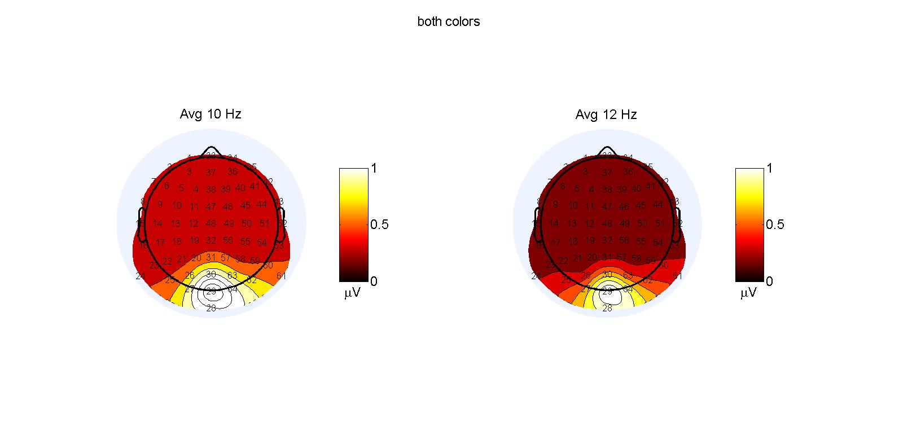
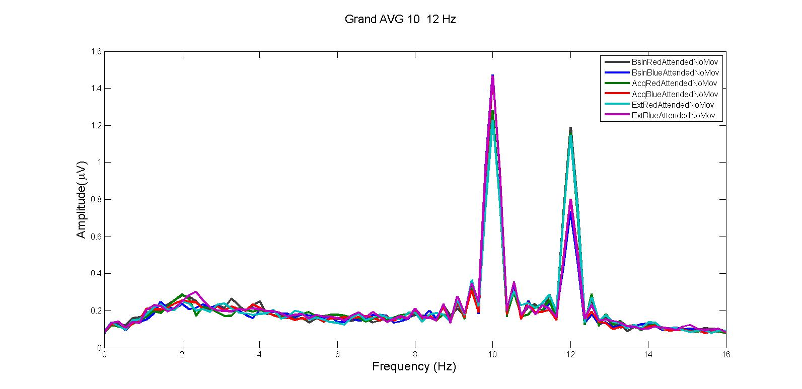

## About the code

Experiment: FSAReward (Ivan Grahek*, Antonio Schettino*, Gilles Pourtois, Ernst Koster, & Søren Andersen) (*: co-first authors)
Code written by: Ivan Grahek & Antonio Schettino (2016-2018)
Description: Code for the analysis of EEG data for Experiment 1 of the SSVEP - reward project.  

_This is an R Markdown document. Markdown is a simple formatting syntax for authoring HTML, PDF, and MS Word documents. For more details on using R Markdown see <http://rmarkdown.rstudio.com>._


\newpage

## Topography & spectra




\newpage
```{r, warning=FALSE, message=FALSE}
# # Clear environemnt and import data------------------------------------------------------------------------------------------------------------------------------------------------------------------------------------------------------

# clear the environment
rm(list=ls())
# clear the console
cat("\014")
#load packages and install them if they're not installed
if (!require("pacman")) install.packages("pacman")
pacman::p_load(reshape2,yarrr,BayesFactor,plyr,ez,schoRsch,brms,knitr,broom, brmstools, BEST)
# set seed
set.seed(42)
# Set working directory
setwd("C:/Users/igrahek/Documents/Studies/SSVEP Reward - Soren & Antonio/Experiment 1/SSVEP and reward/")
# import data
data.raw = read.csv2(file="./data/amplitudes_rewardBoth_wholeSample.csv",header=TRUE,na.strings="NaN") #only good behavior: amplitudes_rewardBoth.csv  # full sample: amplitudes_rewardBoth_wholeSample.csv POORPERF_amplitude_rewardBoth.csv

# Prepare the dataset------------------------------------------------------------------------------------------------------------------------------------------------------------------------------------------------------

# Reshape to long format
data = melt(data.raw,id.vars=c("Subject","Frequency"),
             measure.vars=c("BslnRedAttended","BslnBlueAttended","AcqRedAttended","AcqBlueAttended","ExtRedAttended","ExtBlueAttended"),
             variable.name="Condition",value.name="Amplitude")

# Sort the new dataframe by participant name
data = data[order(data$Subject),]

# Split the variable Condition based on capital letters
data$Condition = gsub("(?!^)(?=[[:upper:]])", " ", data$Condition, perl=T)

# Split the variable condition into multiple variables
Conditions = colsplit(data$Condition, pattern="\\s+",names = c('ExpPhase', 'ColorMoved',"attended","no","moved"))

# Add the variable defining which color is rewarded based on the participant number
data$RewardedColor = ifelse(data$Subject%%2==0,"Blue","Red") # if participant number is even, blue was rewarded

# Add the Conditions needed to the dataset
data$ExpPhase = Conditions[,1]
data$AttendedColor = Conditions[,2]

# Switch the Frequency to the color
data$RecordedFrequency = ifelse(data$Frequency==10,"Blue","Red") # if the recorded frequency is 10Hz assign Blue (color flickering at 10Hz), otherwise assign Red (color flickering at 12Hz)

# Make a new condition based on the attended color and the rewarded color
data$Condition = ifelse(data$AttendedColor==data$RewardedColor, "High_Rew","Low_Rew")

# Make a new condition based on the attended color and the recorded frequency
data$Attention = ifelse(data$AttendedColor==data$RecordedFrequency, "Att","NotAtt")

# Make a new condition based the Condition and the Attention
data$RecordingAndCondition = with(data, paste0(Condition,"_",Attention))

# Select variables which we want to keep
data = subset(data, select=c("Subject","RewardedColor","ExpPhase","AttendedColor","Condition","RecordedFrequency","Attention","RecordingAndCondition","Amplitude"))

# Sort the data
data = data[with(data, order(Subject)), ]

# Normalize the two frequencies
# Make a new variable with mean amplitude across all conditions for each participant and each frequency
data = ddply(data,.(Subject,RecordedFrequency),transform,
                    MeanAmplitude = mean(Amplitude,na.rm=TRUE),
                    SDAmplitude =   sd(Amplitude,na.rm=TRUE))

# Divide amplitudes in each Subject, Frequency, and Condition by the Mean Amplitude
data$Amplitude = data$Amplitude/data$MeanAmplitude

# Calculate the attention indexes - Selectivity (attended-unattended) & total enhancement (attended+unattended) (Andersen & Muller, 2010, PNAS)
data.diff = ddply(data, .(Subject,ExpPhase,Condition), transform, Selectivity = Amplitude[Attention=="Att"]-Amplitude[Attention=="NotAtt"],TotalEnhancement=Amplitude[Attention=="Att"]+Amplitude[Attention=="NotAtt"])
# Delete the Attention column and rows which are not necessary (indexes repeated twice)
data.diff = subset(data.diff,Attention=="Att") #keep only Att as it is equal to NotAtt
data.diff$Attention = NULL  #drop the Attention column

# Sort the data
data.diff$ExpPhase = factor(data.diff$ExpPhase, levels = c("Bsln","Acq","Ext"))
data.diff = data.diff[order(data.diff$Subject,data.diff$Condition,data.diff$ExpPhase),]

# Convert variables to be used in analyses into factors
data[c("Subject", "Condition","ExpPhase", "RewardedColor", "Attention", "RecordingAndCondition")] =
  lapply(data[c("Subject", "Condition","ExpPhase", "RewardedColor", "Attention", "RecordingAndCondition")], factor)

data.diff[c("Subject", "Condition","ExpPhase", "RecordingAndCondition")] =
  lapply(data.diff[c("Subject", "Condition","ExpPhase",  "RecordingAndCondition")], factor)

```
## Plots - raw data

```{r, warning=FALSE, message=FALSE}
# Plot amplitude across experiment phases------------------------------------------------------------------------------------------------------------------------------------------------------------------------------------------------------

plottingConditions = c("Amplitude both reward conditions","Amplitude High_Rew","Amplitude Low_Rew" )
for (i in 1:length(plottingConditions)){

  if(plottingConditions[i]=="Amplitude both reward conditions"){

    #Average over the reward condition and order data for plotting
    dataAmplitudePlot=ddply(data,.(Subject,Attention,ExpPhase),plyr::summarize,Amplitude=mean(Amplitude,na.rm=TRUE))

    #Order the data again in order to be able to plot Condition in the same order as in the other plots
    dataAmplitudePlot$Attention = factor(dataAmplitudePlot$Attention, levels = c("NotAtt","Att"))
    dataAmplitudePlot$ExpPhase = factor(dataAmplitudePlot$ExpPhase, levels = c("Bsln","Acq","Ext"))
    dataAmplitudePlot = dataAmplitudePlot[order(dataAmplitudePlot$Subject,dataAmplitudePlot$ExpPhase,dataAmplitudePlot$Attention),]}

  if(plottingConditions[i]=="Amplitude High_Rew"){dataAmplitudePlot=subset(data,Condition=="High_Rew")}

  if(plottingConditions[i]=="Amplitude Low_Rew"){

    #Order the data again in order to be able to plot Condition in the same order as in the other plots
    dataAmplitudePlot=subset(data,Condition=="Low_Rew")
    dataAmplitudePlot$Attention = factor(dataAmplitudePlot$Attention, levels = c("NotAtt","Att"))
    dataAmplitudePlot$ExpPhase = factor(dataAmplitudePlot$ExpPhase, levels = c("Bsln","Acq","Ext"))
    dataAmplitudePlot = dataAmplitudePlot[order(dataAmplitudePlot$Subject,dataAmplitudePlot$ExpPhase,dataAmplitudePlot$Attention),] #order the data again in order to be able to plot Condition in the same order as in the other plots
    }

# Pirate plot

  pirateplot(formula=Amplitude~Attention+ExpPhase, # dependent~independent variables
             data=dataAmplitudePlot, # data frame
             main=plottingConditions[i], # main title
             xlim=NULL, # x-axis: limits
             xlab="", # x-axis: label
             ylim=c(0.2,2.2), # y-axis: limits
             ylab=expression(paste("Amplitude (",mu,"V)")), # y-axis: label
             inf.method="hdi", # type of inference: 95% Bayesian Highest Density Intervals
             hdi.iter=5000, # number of iterations for estimation of HDI
             inf.within=Subject, # ID variable
             theme=0, # preset theme (0: use your own)
             # theme settings
             # pal="xman", # color palette [see piratepal(palette="all")]
             point.col="black", # points: color
             point.o=.3, # points: opacity (0-1)
             avg.line.col="black", # average line: color
             avg.line.lwd=2, # average line: line width
             avg.line.o=1, # average line: opacity (0-1)
             bar.b.col=NULL, # bars, border: color
             bar.lwd=0, # bars, border: line width
             bar.b.o=0, # bars, border: opacity (0-1)
             bar.f.col=NULL, # bars, filling: color
             bar.f.o=0, # bars, filling: opacity (0-1)
             inf.b.col="black", # inference band, border: color
             inf.lwd=0.1, # inference band, border: line width
             inf.b.o=1, # inference band, border: opacity (0-1)
             inf.f.col="black", # inference band, filling: color
             inf.f.o=0, # inference band, filling: opacity (0-1)
             bean.b.col="black", # bean border, color
             bean.lwd=0.6, # bean border, line width
             bean.lty=1, # bean border, line type (1: solid; 2:dashed; 3: dotted; ...)
             bean.b.o=0.3, # bean border, opacity (0-1)
             bean.f.col="gray", # bean filling, color
             bean.f.o=.1, # bean filling, opacity (0-1)
             cap.beans=TRUE, # max and min values of bean densities are capped at the limits found in the data
             # quant=c(.1,.9), # quantiles (e.g., 10th and 90th)
             # quant.col="black", # quantiles, line: color
             # quant.length=.7, # quantiles, horizontal line length
             # quant.lwd=2, # quantiles, line width
             sortx="sequential",
             gl.col="gray", # gridlines: color
             gl.lwd=c(.75,0), # gridlines: line width
             gl.lty=2, # gridlines: line type (1: solid; 2:dashed; 3: dotted; ...)
             cex.lab=0.8, # axis labels: size
             cex.axis=1, # axis numbers: size
             bty="l", # plot box type
             back.col="white") # background, color
}

```

\newpage

## Statistics 

```{r, warning=FALSE, message=FALSE}
# Set the working directory in order to load the models
# Set working directory
setwd("C:/Users/igrahek/Documents/Studies/SSVEP Reward - Soren & Antonio/Experiment 1/SSVEP and reward/brms_models")

# Modelling the effects of phase, attention, and reward magnitude - All subjects
# 
# # Set the intercept model
# data$ExpPhase=relevel(data$ExpPhase,ref="Bsln")
# data$Condition=relevel(data$Condition,ref="High_Rew")
# data$Attention=relevel(data$Attention,ref="Att")
# 
# # Null model
# null = brm(Amplitude ~ 1 + (1|Subject),
#                               data=data,
#                               family=gaussian(),
#                               warmup = 2000,
#                               iter = 10000,
#                               save_all_pars = TRUE,
#                               control = list(adapt_delta = 0.99),
#                               cores = 4)
# saveRDS(null,file="null.EEG.allsub.rds")
# 
# # Exp phase model
# expphase = brm(Amplitude ~ ExpPhase + (ExpPhase|Subject),
#                                   data=data,
#                                   family=gaussian(),
#                                   warmup = 2000,
#                                   iter = 10000,
#                                   save_all_pars = TRUE,
#                                   control = list(adapt_delta = 0.99),
#                                   cores = 4)
# saveRDS(expphase,file="expphase.EEG.allsubs.rds")
# 
# # Condition model
# condition = brm(Amplitude ~ Condition + (Condition|Subject),
#                                    data=data,
#                                    family=gaussian(),
#                                    warmup = 2000,
#                                    iter = 10000,
#                                    save_all_pars = TRUE,
#                                    control = list(adapt_delta = 0.99),
#                                    cores = 4)
# saveRDS(condition,file="condition.EEG.allsubs.rds")
# 
# # Attention model
# attention = brm(Amplitude ~ Attention + (Attention|Subject),
#                                    data=data,
#                                    family=gaussian(),
#                                    warmup = 2000,
#                                    iter = 10000,
#                                    save_all_pars = TRUE,
#                                    control = list(adapt_delta = 0.99),
#                                    cores = 4)
# saveRDS(attention,file="attention.EEG.allsubs.rds")
# 
# # Two main effects - phase and attention
# phaseANDattention = brm(Amplitude ~ ExpPhase + Attention + (ExpPhase + Attention|Subject),
#                                         data=data,
#                                         family=gaussian(),
#                                         warmup = 2000,
#                                         iter = 10000,
#                                         save_all_pars = TRUE,
#                                         control = list(adapt_delta = 0.99),
#                                         cores = 4)
# saveRDS(phaseANDattention,file="phaseANDattention.EEG.allsubs.rds")
# 
# # Two main effects - reward magnitude and attention
# rewardANDattention = brm(Amplitude ~ Condition + Attention + (Condition + Attention|Subject),
#                                            data=data,
#                                            family=gaussian(),
#                                            warmup = 2000,
#                                            iter = 10000,
#                                            save_all_pars = TRUE,
#                                            control = list(adapt_delta = 0.99),
#                                            cores = 4)
# saveRDS(rewardANDattention,file="rewardANDattention.EEG.allsubs.rds")
# 
# # Three main effects
# threemain = brm(Amplitude ~ Condition + ExpPhase + Attention + (Condition + ExpPhase + Attention|Subject),
#                                           data=data,
#                                           family=gaussian(),
#                                           warmup = 2000,
#                                           iter = 10000,
#                                           save_all_pars = TRUE,
#                                           control = list(adapt_delta = 0.99),
#                                           cores = 4)
# saveRDS(threemain,file="threemain.EEG.allsubs.rds")
# 
# # Full model
# full = brm(Amplitude ~ Condition * ExpPhase * Attention + (Condition * ExpPhase * Attention|Subject),
#                               data=data,
#                               family=gaussian(),
#                               warmup = 2000,
#                               iter = 10000,
#                               save_all_pars = TRUE,
#                               control = list(adapt_delta = 0.99),
#                               cores = 4)
# saveRDS(full,file="full.EEG.allsubs.rds")
# 
# 
# 
# #WAIC
# compare.EEG.waic = WAIC(null, condition, expphase, attention, phaseANDattention, rewardANDattention, threemain, full, compare = FALSE)
# saveRDS(compare.EEG.waic,file="compare.EEG.waic.allsubs.rds")


# read in the models and comparisons
#model.null.threefactors = readRDS("null.EEG.allsub.rds")
# model.condition.threefactors = readRDS("model.condition.threefactors.EEG.allsubs.rds")
#model.attention.threefactors = readRDS("attention.EEG.allsubs.rds")
# model.expphase.threefactors = readRDS("model.expphase.threefactors.EEG.allsubs.rds")
# model.rewardmagnitudeANDattention.threefactors = readRDS("model.rewardmagnitudeANDattention.threefactors.EEG.allsubs.rds")
# model.phaseANDattention.threefactors = readRDS("model.phaseANDattention.threefactors.EEG.allsubs.rds")
#model.threemaineffects.threefactors = readRDS("threemain.EEG.allsubs.rds")
model.full.threefactors = readRDS("full.EEG.allsubs.rds")
#compare.threefactors.EEG.loo = readRDS("compare.threefactors.EEG.loo.allsubs.rds")
compare.threefactors.EEG.waic = readRDS("compare.EEG.waic.allsubs.rds")
```

### Model comparison with WAIC

```{r, warning=FALSE, message=FALSE}
print(compare.threefactors.EEG.waic)
```

### Checking the best model

Plotting the chains
```{r, warning=FALSE, message=FALSE}
# Plot chains
plot(model.full.threefactors, pars = "^b_", ask = FALSE, N=6)
```

Summary of the best model 

```{r, warning=FALSE, message=FALSE}
# Summary of the best model
print(tidy(model.full.threefactors, par_type = "non-varying"), digits = 1)
```

### Plotting the best model

Attended color (plot 1) and Not attended color (plot 2)

```{r, warning=FALSE, message=FALSE}
# Plot the interaction between Phase and Attention in two conditions of reward probability
conditions = data.frame(Attention = c("Att", "NotAtt"))
plot(marginal_effects(model.full.threefactors, effects = "ExpPhase:Condition", conditions = conditions),ask=FALSE)
```

### Inference about the best model

```{r, warning=FALSE, message=FALSE}
post = posterior_samples(model.full.threefactors, "^b")

# Calculate posteriors for each condition

################################################ Baseline ####

##################### Attended

######### High reward
Baseline_High_Attended = post[["b_Intercept"]]
######### Low reward
Baseline_Low_Attended = post[["b_Intercept"]] + 
  post[["b_ConditionLow_Rew"]] 

##################### Not Attended

######### High reward
Baseline_High_NotAttended = post[["b_Intercept"]] + 
  post[["b_AttentionNotAtt"]]
######### Low reward
Baseline_Low_NotAttended = post[["b_Intercept"]] + 
  post[["b_AttentionNotAtt"]] + 
  post[["b_ConditionLow_Rew"]] + 
  post[["b_ConditionLow_Rew:AttentionNotAtt"]]

################################################ Acquistion

##################### Attended

######### High reward
Acquisition_High_Attended = post[["b_Intercept"]] + 
  post[["b_ExpPhaseAcq"]] 
######### Low reward
Acquisition_Low_Attended = post[["b_Intercept"]] + 
  post[["b_ExpPhaseAcq"]] + 
  post[["b_ConditionLow_Rew"]] + 
  post[["b_ConditionLow_Rew:ExpPhaseAcq"]]

##################### Not Attended

######### High reward
Acquisition_High_NotAttended = post[["b_Intercept"]] + 
  post[["b_ExpPhaseAcq"]] + 
  post[["b_AttentionNotAtt"]]
######### Low reward
Acquisition_Low_NotAttended = post[["b_Intercept"]] + 
  post[["b_ExpPhaseAcq"]] + 
  post[["b_AttentionNotAtt"]] + 
  post[["b_ConditionLow_Rew"]] + 
  post[["b_ExpPhaseAcq:AttentionNotAtt"]] +
  post[["b_ConditionLow_Rew:ExpPhaseAcq"]] + 
  post[["b_ConditionLow_Rew:ExpPhaseAcq:AttentionNotAtt"]]

################################################ Extinction

##################### Attended

######### High reward
Extinction_High_Attended = post[["b_Intercept"]] + 
  post[["b_ExpPhaseExt"]] 
######### Low reward
Extinction_Low_Attended = post[["b_Intercept"]] + 
  post[["b_ExpPhaseExt"]] + 
  post[["b_ConditionLow_Rew"]] + 
  post[["b_ConditionLow_Rew:ExpPhaseExt"]]

##################### Not Attended

######### High reward
Extinction_High_NotAttended = post[["b_Intercept"]] + 
  post[["b_ExpPhaseExt"]] + 
  post[["b_AttentionNotAtt"]]
######### Low reward
Extinction_Low_NotAttended = post[["b_Intercept"]] + 
  post[["b_ExpPhaseExt"]] + 
  post[["b_AttentionNotAtt"]] + 
  post[["b_ConditionLow_Rew"]] + 
  post[["b_ExpPhaseExt:AttentionNotAtt"]] +
  post[["b_ConditionLow_Rew:ExpPhaseExt"]] + 
  post[["b_ConditionLow_Rew:ExpPhaseExt:AttentionNotAtt"]]
```

Check the difference between high and low reward in basline attended

```{r, warning=FALSE, message=FALSE}
# Difference between high and low reward in acquisition attended
Diff_Rew_Bsln_Att = Baseline_High_Attended - Baseline_Low_Attended
plotPost(Diff_Rew_Bsln_Att, xlab = "", col = "#b3cde0", showCurve = FALSE, cex = 1, compVal = 0)

# Evidence ratio for the hypothesis that the high rewarded condition is higher than the low rewarded condition for attended
h1 = hypothesis(post, "b_Intercept > b_Intercept + b_ConditionLow_Rew")
print(h1)
```

Check the difference between high and low reward in acquisition attended

```{r, warning=FALSE, message=FALSE}
# Difference between high and low reward in acquisition attended
Diff_Rew_Acq_Att = Acquisition_High_Attended - Acquisition_Low_Attended
plotPost(Diff_Rew_Acq_Att, xlab = "", col = "#b3cde0", cex = 1, showCurve = FALSE, compVal = 0)

# Evidence ratio for the hypothesis that the high rewarded condition is higher than the low rewarded condition for attended
h1 = hypothesis(post, "b_Intercept +  b_ExpPhaseAcq > b_Intercept +  b_ExpPhaseAcq + b_ConditionLow_Rew  + b_ConditionLow_Rew:ExpPhaseAcq")
print(h1)
```

Check the difference between high and low reward in extinction attended

```{r, warning=FALSE, message=FALSE}
# Evidence ratio for the hypothesis that the high rewarded condition is higher than the low rewarded condition for attended
h1 = hypothesis(post, "b_Intercept +  b_ExpPhaseExt > b_Intercept +  b_ExpPhaseExt + b_ConditionLow_Rew  + b_ConditionLow_Rew:ExpPhaseExt")
print(h1)
```

Check the difference between high and low reward in baseline not attended

```{r, warning=FALSE, message=FALSE}
# Evidence ratio for the hypothesis that the high rewarded condition is higher than the low rewarded condition for not attended
h2 = hypothesis(post, "b_Intercept + b_AttentionNotAtt > b_Intercept + b_AttentionNotAtt + b_ConditionLow_Rew")
print(h2)
```

Check the difference between high and low reward in acquisition not attended

```{r, warning=FALSE, message=FALSE}
# Evidence ratio for the hypothesis that the high rewarded condition is higher than the low rewarded condition for not attended
h2 = hypothesis(post, "b_Intercept +  b_ExpPhaseAcq + b_AttentionNotAtt + b_ExpPhaseAcq:AttentionNotAtt > b_Intercept +  b_ExpPhaseAcq + b_AttentionNotAtt + b_ConditionLow_Rew  + b_ConditionLow_Rew:ExpPhaseAcq + b_ExpPhaseAcq:AttentionNotAtt + b_ConditionLow_Rew:ExpPhaseAcq:AttentionNotAtt")
print(h2)
```

Check the difference between high and low reward in extinction not attended

```{r, warning=FALSE, message=FALSE}
# Evidence ratio for the hypothesis that the high rewarded condition is higher than the low rewarded condition for not attended
h2 = hypothesis(post, "b_Intercept +  b_ExpPhaseExt + b_AttentionNotAtt + b_ExpPhaseExt:AttentionNotAtt > b_Intercept +  b_ExpPhaseExt + b_AttentionNotAtt + b_ConditionLow_Rew  + b_ConditionLow_Rew:ExpPhaseExt + b_ExpPhaseExt:AttentionNotAtt + b_ConditionLow_Rew:ExpPhaseExt:AttentionNotAtt")
print(h2)
```


## Statistics - Blue - high reward

```{r, warning=FALSE, message=FALSE}
# Set the working directory in order to load the models
# Set working directory
setwd("C:/Users/igrahek/Documents/Studies/SSVEP Reward - Soren & Antonio/Experiment 1/SSVEP and reward/brms_models")


# read in the models and comparisons
#model.null.threefactors = readRDS("null.EEG.allsub.rds")
# model.condition.threefactors = readRDS("model.condition.threefactors.EEG.allsubs.rds")
#model.attention.threefactors = readRDS("attention.EEG.allsubs.rds")
# model.expphase.threefactors = readRDS("model.expphase.threefactors.EEG.allsubs.rds")
# model.rewardmagnitudeANDattention.threefactors = readRDS("model.rewardmagnitudeANDattention.threefactors.EEG.allsubs.rds")
# model.phaseANDattention.threefactors = readRDS("model.phaseANDattention.threefactors.EEG.allsubs.rds")
#model.threemaineffects.threefactors = readRDS("threemain.EEG.allsubs.rds")
model.full.threefactors = readRDS("full.EEG.allsubs.blue.rds")
#compare.threefactors.EEG.loo = readRDS("compare.threefactors.EEG.loo.allsubs.rds")
compare.threefactors.EEG.waic = readRDS("compare.EEG.waic.allsubs.blue.rds")
```

### Model comparison with WAIC

```{r, warning=FALSE, message=FALSE}
print(compare.threefactors.EEG.waic)
```

### Checking the best model

Plotting the chains
```{r, warning=FALSE, message=FALSE}
# Plot chains
plot(model.full.threefactors, pars = "^b_", ask = FALSE, N=6)
```

Summary of the best model 

```{r, warning=FALSE, message=FALSE}
# Summary of the best model
print(tidy(model.full.threefactors, par_type = "non-varying"), digits = 1)
```

### Plotting the best model

Attended color (plot 1) and Not attended color (plot 2)

```{r, warning=FALSE, message=FALSE}
# Plot the interaction between Phase and Attention in two conditions of reward probability
conditions = data.frame(Attention = c("Att", "NotAtt"))
plot(marginal_effects(model.full.threefactors, effects = "ExpPhase:Condition", conditions = conditions),ask=FALSE)
```

### Inference about the best model

```{r, warning=FALSE, message=FALSE}
post = posterior_samples(model.full.threefactors, "^b")
```

Check the difference between high and low reward in basline attended

```{r, warning=FALSE, message=FALSE}
# Evidence ratio for the hypothesis that the high rewarded condition is higher than the low rewarded condition for attended
h1 = hypothesis(post, "b_Intercept > b_Intercept + b_ConditionLow_Rew")
print(h1)
```

Check the difference between high and low reward in acquisition attended

```{r, warning=FALSE, message=FALSE}
# Evidence ratio for the hypothesis that the high rewarded condition is higher than the low rewarded condition for attended
h1 = hypothesis(post, "b_Intercept +  b_ExpPhaseAcq > b_Intercept +  b_ExpPhaseAcq + b_ConditionLow_Rew  + b_ConditionLow_Rew:ExpPhaseAcq")
print(h1)
```

Check the difference between high and low reward in extinction attended

```{r, warning=FALSE, message=FALSE}
# Evidence ratio for the hypothesis that the high rewarded condition is higher than the low rewarded condition for attended
h1 = hypothesis(post, "b_Intercept +  b_ExpPhaseExt > b_Intercept +  b_ExpPhaseExt + b_ConditionLow_Rew  + b_ConditionLow_Rew:ExpPhaseExt")
print(h1)
```

Check the difference between high and low reward in baseline not attended

```{r, warning=FALSE, message=FALSE}
# Evidence ratio for the hypothesis that the high rewarded condition is higher than the low rewarded condition for not attended
h2 = hypothesis(post, "b_Intercept + b_AttentionNotAtt > b_Intercept + b_AttentionNotAtt + b_ConditionLow_Rew")
print(h2)
```

Check the difference between high and low reward in acquisition not attended

```{r, warning=FALSE, message=FALSE}
# Evidence ratio for the hypothesis that the high rewarded condition is higher than the low rewarded condition for not attended
h2 = hypothesis(post, "b_Intercept +  b_ExpPhaseAcq + b_AttentionNotAtt + b_ExpPhaseAcq:AttentionNotAtt > b_Intercept +  b_ExpPhaseAcq + b_AttentionNotAtt + b_ConditionLow_Rew  + b_ConditionLow_Rew:ExpPhaseAcq + b_ExpPhaseAcq:AttentionNotAtt + b_ConditionLow_Rew:ExpPhaseAcq:AttentionNotAtt")
print(h2)
```

Check the difference between high and low reward in extinction not attended

```{r, warning=FALSE, message=FALSE}
# Evidence ratio for the hypothesis that the high rewarded condition is higher than the low rewarded condition for not attended
h2 = hypothesis(post, "b_Intercept +  b_ExpPhaseExt + b_AttentionNotAtt + b_ExpPhaseExt:AttentionNotAtt > b_Intercept +  b_ExpPhaseExt + b_AttentionNotAtt + b_ConditionLow_Rew  + b_ConditionLow_Rew:ExpPhaseExt + b_ExpPhaseExt:AttentionNotAtt + b_ConditionLow_Rew:ExpPhaseExt:AttentionNotAtt")
print(h2)
```


## Statistics - Red - high reward

```{r, warning=FALSE, message=FALSE}
# Set the working directory in order to load the models
# Set working directory
setwd("C:/Users/igrahek/Documents/Studies/SSVEP Reward - Soren & Antonio/Experiment 1/SSVEP and reward/brms_models")


# read in the models and comparisons
#model.null.threefactors = readRDS("null.EEG.allsub.rds")
# model.condition.threefactors = readRDS("model.condition.threefactors.EEG.allsubs.rds")
#model.attention.threefactors = readRDS("attention.EEG.allsubs.rds")
# model.expphase.threefactors = readRDS("model.expphase.threefactors.EEG.allsubs.rds")
# model.rewardmagnitudeANDattention.threefactors = readRDS("model.rewardmagnitudeANDattention.threefactors.EEG.allsubs.rds")
# model.phaseANDattention.threefactors = readRDS("model.phaseANDattention.threefactors.EEG.allsubs.rds")
#model.threemaineffects.threefactors = readRDS("threemain.EEG.allsubs.rds")
model.full.threefactors = readRDS("full.EEG.allsubs.red.rds")
#compare.threefactors.EEG.loo = readRDS("compare.threefactors.EEG.loo.allsubs.rds")
compare.threefactors.EEG.waic = readRDS("compare.EEG.waic.allsubs.red.rds")
```

### Model comparison with WAIC

```{r, warning=FALSE, message=FALSE}
print(compare.threefactors.EEG.waic)
```

### Checking the best model

Plotting the chains
```{r, warning=FALSE, message=FALSE}
# Plot chains
plot(model.full.threefactors, pars = "^b_", ask = FALSE, N=6)
```

Summary of the best model 

```{r, warning=FALSE, message=FALSE}
# Summary of the best model
print(tidy(model.full.threefactors, par_type = "non-varying"), digits = 1)
```

### Plotting the best model

Attended color (plot 1) and Not attended color (plot 2)

```{r, warning=FALSE, message=FALSE}
# Plot the interaction between Phase and Attention in two conditions of reward probability
conditions = data.frame(Attention = c("Att", "NotAtt"))
plot(marginal_effects(model.full.threefactors, effects = "ExpPhase:Condition", conditions = conditions),ask=FALSE)
```

### Inference about the best model

```{r, warning=FALSE, message=FALSE}
post = posterior_samples(model.full.threefactors, "^b")
```

Check the difference between high and low reward in basline attended

```{r, warning=FALSE, message=FALSE}
# Evidence ratio for the hypothesis that the high rewarded condition is higher than the low rewarded condition for attended
h1 = hypothesis(post, "b_Intercept > b_Intercept + b_ConditionLow_Rew")
print(h1)
```

Check the difference between high and low reward in acquisition attended

```{r, warning=FALSE, message=FALSE}
# Evidence ratio for the hypothesis that the high rewarded condition is higher than the low rewarded condition for attended
h1 = hypothesis(post, "b_Intercept +  b_ExpPhaseAcq > b_Intercept +  b_ExpPhaseAcq + b_ConditionLow_Rew  + b_ConditionLow_Rew:ExpPhaseAcq")
print(h1)
```

Check the difference between high and low reward in extinction attended

```{r, warning=FALSE, message=FALSE}
# Evidence ratio for the hypothesis that the high rewarded condition is higher than the low rewarded condition for attended
h1 = hypothesis(post, "b_Intercept +  b_ExpPhaseExt > b_Intercept +  b_ExpPhaseExt + b_ConditionLow_Rew  + b_ConditionLow_Rew:ExpPhaseExt")
print(h1)
```

Check the difference between high and low reward in baseline not attended

```{r, warning=FALSE, message=FALSE}
# Evidence ratio for the hypothesis that the high rewarded condition is higher than the low rewarded condition for not attended
h2 = hypothesis(post, "b_Intercept + b_AttentionNotAtt > b_Intercept + b_AttentionNotAtt + b_ConditionLow_Rew")
print(h2)
```

Check the difference between high and low reward in acquisition not attended

```{r, warning=FALSE, message=FALSE}
# Evidence ratio for the hypothesis that the high rewarded condition is higher than the low rewarded condition for not attended
h2 = hypothesis(post, "b_Intercept +  b_ExpPhaseAcq + b_AttentionNotAtt + b_ExpPhaseAcq:AttentionNotAtt > b_Intercept +  b_ExpPhaseAcq + b_AttentionNotAtt + b_ConditionLow_Rew  + b_ConditionLow_Rew:ExpPhaseAcq + b_ExpPhaseAcq:AttentionNotAtt + b_ConditionLow_Rew:ExpPhaseAcq:AttentionNotAtt")
print(h2)
```

Check the difference between high and low reward in extinction not attended

```{r, warning=FALSE, message=FALSE}
# Evidence ratio for the hypothesis that the high rewarded condition is higher than the low rewarded condition for not attended
h2 = hypothesis(post, "b_Intercept +  b_ExpPhaseExt + b_AttentionNotAtt + b_ExpPhaseExt:AttentionNotAtt > b_Intercept +  b_ExpPhaseExt + b_AttentionNotAtt + b_ConditionLow_Rew  + b_ConditionLow_Rew:ExpPhaseExt + b_ExpPhaseExt:AttentionNotAtt + b_ConditionLow_Rew:ExpPhaseExt:AttentionNotAtt")
print(h2)
```

