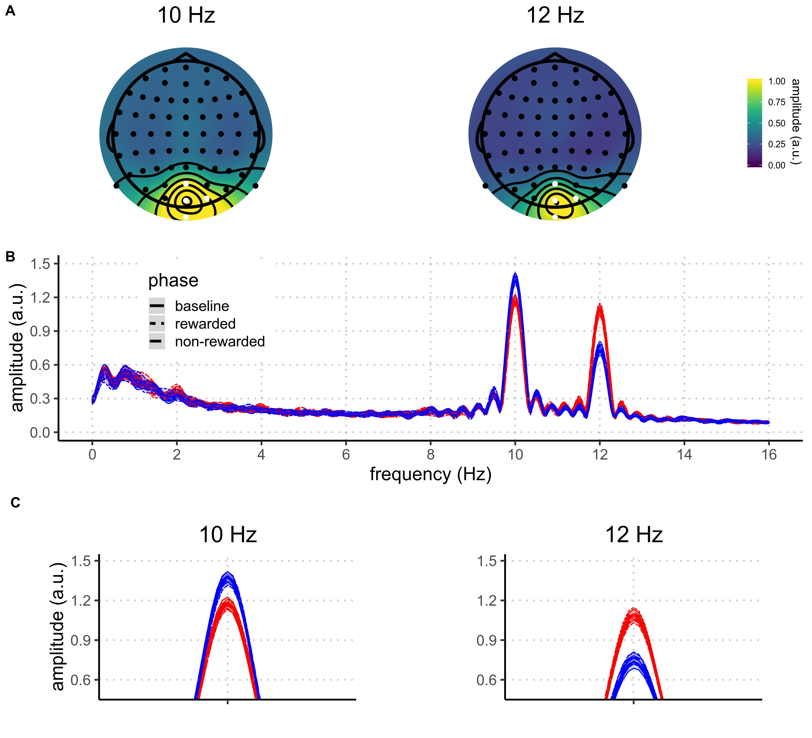

# About the code

Experiment: FSAReward (Ivan Grahek*, Antonio Schettino*, Gilles Pourtois, Ernst Koster, & Søren Andersen) (*: co-first authors)
Code written by: Ivan Grahek & Antonio Schettino (2016-2018)
Description: Code for the analysis of EEG data for Experiment 1 of the SSVEP - reward project.  

_This is an R Markdown document. Markdown is a simple formatting syntax for authoring HTML, PDF, and MS Word documents. For more details on using R Markdown see <http://rmarkdown.rstudio.com>._


\newpage

# EEG
## Topography & spectra


\newpage

## Import data
```{r, warning=FALSE, message=FALSE}
# # Clear environemnt and import data------------------------------------------------------------------------------------------------------------------------------------------------------------------------------------------------------

# clear the environment
rm(list=ls())
# clear the console
cat("\014")
#load packages and install them if they're not installed
if (!require("pacman")) install.packages("pacman")
pacman::p_load(reshape2,yarrr,BayesFactor,plyr,ez,schoRsch,brms,knitr,broom, brmstools, BEST, tidyverse, here)
# set seed
set.seed(42)
# Set working directory
#setwd(here())
# import data
data.raw = read.csv(file = here("EEG_preprocessing/movement","grandAverage_amplitudes.csv"),header=TRUE,na.strings="NaN") 

# Rename columns
colnames(data.raw) = c("Subject","Frequency","BslnRedAttendedNomov","BslnBlueAttendedNomov","AcqRedAttendedNomov","AcqBlueAttendedNomov","ExtRedAttendedNomov","ExtBlueAttendedNomov","BslnRedAttendedMov","BslnBlueAttendedMov","AcqRedAttendedMov","AcqBlueAttendedMov","ExtRedAttendedMov","ExtBlueAttendedMov")

# # Reshape to long format - take only no movement trials
data = melt(data.raw,id.vars=c("Subject","Frequency"),
            measure.vars=c("BslnRedAttendedNomov","BslnBlueAttendedNomov","AcqRedAttendedNomov","AcqBlueAttendedNomov","ExtRedAttendedNomov","ExtBlueAttendedNomov","BslnRedAttendedMov","BslnBlueAttendedMov","AcqRedAttendedMov","AcqBlueAttendedMov","ExtRedAttendedMov","ExtBlueAttendedMov"),
            variable.name="Condition",value.name="Amplitude")

# Sort the new dataframe by participant name
data = data[order(data$Subject),]

# Split the variable Condition based on capital letters
data$Condition = gsub("(?!^)(?=[[:upper:]])", " ", data$Condition, perl=T)

# Split the variable condition into multiple variables
Conditions = colsplit(data$Condition, pattern="\\s+",names = c('ExpPhase', 'ColorMoved',"attended","no","moved"))

# Add the variable defining which color is rewarded based on the participant number
data$RewardedColor = ifelse(data$Subject%%2==0,"Blue","Red") # if participant number is even, blue was rewarded

# Add the Conditions needed to the dataset
data$ExpPhase = Conditions[,1]
data$AttendedColor = Conditions[,2]
data$Movement = Conditions[,4]

# Switch the Frequency to the color
data$RecordedFrequency = ifelse(data$Frequency==10,"Blue","Red") # if the recorded frequency is 10Hz assign Blue (color flickering at 10Hz), otherwise assign Red (color flickering at 12Hz)

# Make a new condition based on the attended color and the rewarded color
data$Condition = ifelse(data$AttendedColor==data$RewardedColor, "High_Rew","Low_Rew")

# Make a new condition based on the attended color and the recorded frequency
data$Attention = ifelse(data$AttendedColor==data$RecordedFrequency, "Att","NotAtt")

# Make a new condition based the Condition and the Attention
data$RecordingAndCondition = with(data, paste0(Condition,"_",Attention))

# Select variables which we want to keep
data = subset(data, select=c("Subject","RewardedColor","ExpPhase","AttendedColor","Condition","RecordedFrequency","Attention","RecordingAndCondition","Movement","Amplitude"))

# Sort the data 
data = data[with(data, order(Subject)), ]

# Make a new variable with mean amplitude across all conditions for each participant and each frequency (normalization)
data = ddply(data,.(Subject,RecordedFrequency),transform,
             MeanAmplitude = mean(Amplitude[ExpPhase=="Bsln"],na.rm=TRUE),
             SDAmplitude =   sd(Amplitude,na.rm=TRUE))

# Divide amplitudes in each Subject, Frequency, and Condition by the Mean Amplitude
data$Amplitude = data$Amplitude/data$MeanAmplitude

# Calculate the attention indexes - Selectivity (attended-unattended) & total enhancement (attended+unattended) (Andersen & Muller, 2010, PNAS)
data.diff = ddply(data, .(Subject,ExpPhase,Condition), transform, Selectivity = Amplitude[Attention=="Att"]-Amplitude[Attention=="NotAtt"],TotalEnhancement=Amplitude[Attention=="Att"]+Amplitude[Attention=="NotAtt"])
# Delete the Attention column and rows which are not necessary (indexes repeated twice)
data.diff = subset(data.diff,Attention=="Att") #keep only Att as it is equal to NotAtt
data.diff$Attention = NULL  #drop the Attention column

# Sort the data 
data.diff$ExpPhase = factor(data.diff$ExpPhase, levels = c("Bsln","Acq","Ext"))
data.diff = data.diff[order(data.diff$Subject,data.diff$Condition,data.diff$ExpPhase),]

# Calculate the reward index - High reward minus Low reward
data.reward = ddply(data, .(Subject,ExpPhase,Attention), transform, Reward = Amplitude[Condition=="High_Rew"]-Amplitude[Condition=="Low_Rew"])
# Delete the Attention column and rows which are not necessary (indexes repeated twice)
data.reward = subset(data.reward,Condition=="High_Rew") #keep only Att as it is equal to NotAtt
data.reward$Condition = NULL  #drop the Condition column

# Sort the data 
data.reward$ExpPhase = factor(data.reward$ExpPhase, levels = c("Bsln","Acq","Ext"))
data.reward = data.reward[order(data.reward$Subject,data.reward$Attention,data.reward$ExpPhase),]

# Convert variables to be used in analyses into factors
data[c("Subject", "Condition","ExpPhase", "RewardedColor", "Attention", "RecordingAndCondition")] = 
  lapply(data[c("Subject", "Condition","ExpPhase", "RewardedColor", "Attention", "RecordingAndCondition")], factor)

data.diff[c("Subject", "Condition","ExpPhase", "RecordingAndCondition")] = 
  lapply(data.diff[c("Subject", "Condition","ExpPhase",  "RecordingAndCondition")], factor)

# Save the final data into a new variable
data_all = data

```


## All trials
### Means - raw data

```{r, warning=FALSE, message=FALSE}
summary = ddply(data,.(Attention,ExpPhase,Condition),plyr::summarize,Mean=c(paste(round(mean(Amplitude, na.rm = TRUE), digits = 2), " [", round(hdi(Amplitude)[[1]], digits = 2), " ", round(hdi(Amplitude)[[2]], digits = 2), "]")))

names(summary) = c("Attention", "Reward phase", "Reward probability", "Amplitude")

summary$Attention = recode(summary$Attention,
                           "Att" = "Attended",
                           "NotAtt" = "Unattended")

summary$`Reward phase` = recode(summary$`Reward phase`,
                           "Acq" = "Acquisition",
                           "Bsln" = "Baseline",
                           "Ext" = "Extinction")

summary$`Reward probability` = recode(summary$`Reward probability`,
                           "High_Rew" = "High",
                           "Low_Rew" = "Low")

summary = as.data.frame(summary)

summary$`Reward phase` = factor(summary$`Reward phase`, levels = c("Baseline","Acquisition","Extinction"))
summary = summary[order(summary$Attention,summary$`Reward phase`,summary$`Reward probability`),]
row.names(summary) = NULL

kable(summary, caption = "Amplitudes per condition")
```

### Plots - raw data

```{r, warning=FALSE, message=FALSE}
# Plot amplitude across experiment phases------------------------------------------------------------------------------------------------------------------------------------------------------------------------------------------------------
# prepare data for plotting
dataPlot = data

# rename variables
colnames(dataPlot)[colnames(dataPlot)=="ExpPhase"] <- "Reward phase"
colnames(dataPlot)[colnames(dataPlot)=="Condition"] <- "Reward probability"

# rename conditions
dataPlot$`Reward phase` = recode(dataPlot$`Reward phase`,
                                  "Acq" = "Acquisition",
                                  "Bsln" = "Baseline",
                                  "Ext" = "Extinction")

dataPlot$`Reward probability` = recode(dataPlot$`Reward probability`,
                                        "High_Rew" = "High",
                                        "Low_Rew" = "Low")

#order
dataPlot$`Reward phase` = factor(dataPlot$`Reward phase`, levels = c("Baseline","Acquisition","Extinction"))
dataPlot = dataPlot[order(dataPlot$Attention,dataPlot$`Reward phase`,dataPlot$`Reward probability`),]


plottingConditions = c("Attended","Unattended" )
for (i in 1:length(plottingConditions)){
  
  if(plottingConditions[i]=="Attended"){dataAmplitudePlot=subset(dataPlot,Attention=="Att")}
  
  if(plottingConditions[i]=="Unattended"){dataAmplitudePlot=subset(dataPlot,Attention=="NotAtt")}  

# Pirate plot

    pirateplot(formula = Amplitude ~ `Reward phase` + `Reward probability`, # dependent~independent variables
             data=dataAmplitudePlot, # data frame
             main=plottingConditions[i], # main title
             ylim=c(0.2,2.2), # y-axis: limits
             ylab=expression(paste("Amplitude (",mu,"V)")), # y-axis: label
             theme=0, # preset theme (0: use your own)
             point.col="black", # points: color
             point.o=.3, # points: opacity (0-1)
             avg.line.col="black", # average line: color
             avg.line.lwd=2, # average line: line width
             avg.line.o=1, # average line: opacity (0-1)
             bean.b.col="black", # bean border, color
             bean.lwd=0.6, # bean border, line width
             bean.lty=1, # bean border, line type (1: solid; 2:dashed; 3: dotted; ...)
             bean.b.o=0.3, # bean border, opacity (0-1)
             bean.f.col="gray", # bean filling, color
             bean.f.o=.1, # bean filling, opacity (0-1)
             cap.beans=FALSE, # max and min values of bean densities are capped at the limits found in the data
             gl.col="gray", # gridlines: color
             gl.lty=2, # gridlines: line type (1: solid; 2:dashed; 3: dotted; ...)
             cex.lab=1, # axis labels: size
             cex.axis=1, # axis numbers: size
             cex.names = 1,
             bty="l", # plot box type
             back.col="white") # background, color
}

```

\newpage

### Statistics 

```{r, warning=FALSE, message=FALSE}
# Set the working directory in order to load the models
# Set working directory
setwd(here("brms_models"))

model.rewardTimesPhasePlusAtt = readRDS("rewardTimesPhasePlusAtt.EEG.alltrials.rds")
compare.threefactors.EEG.waic = readRDS("compare.EEG.waic.alltrials.rds")
bR2.null.EEG = readRDS("bR2.null.EEG.alltrials")
bR2.expphase.EEG = readRDS("bR2.expphase.EEG.alltrials")
bR2.attention.EEG = readRDS("bR2.attention.EEG.alltrials")
bR2.phaseANDattention.EEG = readRDS("bR2.phaseANDattention.EEG.alltrials")
bR2.phaseANDattention_interaction.EEG = readRDS("bR2.phaseANDattention_interaction.EEG.alltrials")
bR2.rewardTimesPhasePlusAtt.EEG = readRDS("bR2.rewardTimesPhasePlusAtt.EEG.alltrials")
bR2.full.EEG = readRDS("bR2.full.EEG.alltrials")
```

### Model comparison with WAIC

```{r, warning=FALSE, message=FALSE}
print(compare.threefactors.EEG.waic)
```

### Bayesian R squared 

Null model
```{r, warning=FALSE, message=FALSE}
print(bR2.null.EEG)
```

Experiment phase
```{r, warning=FALSE, message=FALSE}
print(bR2.expphase.EEG)
```

Attention model
```{r, warning=FALSE, message=FALSE}
print(bR2.attention.EEG)
```

Phase and attention model
```{r, warning=FALSE, message=FALSE}
print(bR2.phaseANDattention.EEG)
```

Phase and attention interaction model
```{r, warning=FALSE, message=FALSE}
print(bR2.phaseANDattention_interaction.EEG)
```

Reward times phase plus attention model
```{r, warning=FALSE, message=FALSE}
print(bR2.rewardTimesPhasePlusAtt.EEG)
```

Full model
```{r, warning=FALSE, message=FALSE}
print(bR2.full.EEG)
```

### Checking the best model

Plotting the chains
```{r, warning=FALSE, message=FALSE}
# Plot chains
plot(model.rewardTimesPhasePlusAtt, pars = "^b_", ask = FALSE, N=6)
```

Summary of the best model 

```{r, warning=FALSE, message=FALSE}
# Summary of the best model
print(tidy(model.rewardTimesPhasePlusAtt, par_type = "non-varying"), digits = 1)
```

### Plotting the best model

```{r, warning=FALSE, message=FALSE}
post = posterior_samples(model.rewardTimesPhasePlusAtt, "^b")

# Calculate posteriors for each condition

################################################ Baseline ####

##################### Attended

######### High reward
Baseline_High_Attended = post[["b_Intercept"]]
######### Low reward
Baseline_Low_Attended = post[["b_Intercept"]] + 
  post[["b_ConditionLow_Rew"]] 

##################### Not Attended

######### High reward
Baseline_High_NotAttended = post[["b_Intercept"]] + 
  post[["b_AttentionNotAtt"]]
######### Low reward
Baseline_Low_NotAttended = post[["b_Intercept"]] + 
  post[["b_AttentionNotAtt"]] + 
  post[["b_ConditionLow_Rew"]] 

################################################ Acquistion

##################### Attended

######### High reward
Acquisition_High_Attended = post[["b_Intercept"]] + 
  post[["b_ExpPhaseAcq"]] 
######### Low reward
Acquisition_Low_Attended = post[["b_Intercept"]] + 
  post[["b_ExpPhaseAcq"]] + 
  post[["b_ConditionLow_Rew"]] + 
  post[["b_ConditionLow_Rew:ExpPhaseAcq"]]

##################### Not Attended

######### High reward
Acquisition_High_NotAttended = post[["b_Intercept"]] + 
  post[["b_ExpPhaseAcq"]] + 
  post[["b_AttentionNotAtt"]] 
  
######### Low reward
Acquisition_Low_NotAttended = post[["b_Intercept"]] + 
  post[["b_ExpPhaseAcq"]] + 
  post[["b_AttentionNotAtt"]] + 
  post[["b_ConditionLow_Rew"]] +
  post[["b_ConditionLow_Rew:ExpPhaseAcq"]] 


################################################ Extinction

##################### Attended

######### High reward
Extinction_High_Attended = post[["b_Intercept"]] + 
  post[["b_ExpPhaseExt"]] 
######### Low reward
Extinction_Low_Attended = post[["b_Intercept"]] + 
  post[["b_ExpPhaseExt"]] + 
  post[["b_ConditionLow_Rew"]] + 
  post[["b_ConditionLow_Rew:ExpPhaseExt"]]

##################### Not Attended

######### High reward
Extinction_High_NotAttended = post[["b_Intercept"]] + 
  post[["b_ExpPhaseExt"]] + 
  post[["b_AttentionNotAtt"]]
######### Low reward
Extinction_Low_NotAttended = post[["b_Intercept"]] + 
  post[["b_ExpPhaseExt"]] + 
  post[["b_AttentionNotAtt"]] + 
  post[["b_ConditionLow_Rew"]] +
  post[["b_ConditionLow_Rew:ExpPhaseExt"]] 

```

```{r, warning=FALSE, message=FALSE}
# make a data frame

posterior_conditions = melt(data.frame(Baseline_High_Attended, Baseline_High_NotAttended, Baseline_Low_Attended, Baseline_Low_NotAttended, Acquisition_High_Attended, Acquisition_High_NotAttended, Acquisition_Low_Attended, Acquisition_Low_NotAttended, Extinction_High_Attended, Extinction_High_NotAttended, Extinction_Low_Attended, Extinction_Low_NotAttended))

posterior_conditions =  posterior_conditions %>% separate(variable, c("Reward Phase", "Reward Probability", "Attention"), "_", extra = "merge")

posterior_conditions$Attention = recode(posterior_conditions$Attention,
                           "Attended" = "Attended",
                           "NotAttended" = "Unattended")

names(posterior_conditions)[4] = "Amplitude"


#order
#dataPlot$`Reward phase` = factor(dataPlot$`Reward phase`, levels = c("Baseline","Acquisition","Extinction"))
#dataPlot = dataPlot[order(dataPlot$Attention,dataPlot$`Reward phase`,dataPlot$`Reward probability`),]


plottingConditions = c("Attended","Unattended" )
for (i in 1:length(plottingConditions)){
  
  if(plottingConditions[i]=="Attended"){dataAmplitudePlot=subset(posterior_conditions,Attention=="Attended")}
  
  if(plottingConditions[i]=="Unattended"){dataAmplitudePlot=subset(posterior_conditions,Attention=="Unattended")}  

# Pirate plot

    pirateplot(formula = Amplitude ~ `Reward Phase` + `Reward Probability`, # dependent~independent variables
             data=dataAmplitudePlot, # data frame
             main=plottingConditions[i], # main title
             ylim=c(0.7,1.3), # y-axis: limits
             ylab=expression(paste("Amplitude (",mu,"V)")), # y-axis: label
             theme=0, # preset theme (0: use your own)
             avg.line.col="black", # average line: color
             avg.line.lwd=2, # average line: line width
             avg.line.o=1, # average line: opacity (0-1)
             bean.b.col="black", # bean border, color
             bean.lwd=0.6, # bean border, line width
             bean.lty=1, # bean border, line type (1: solid; 2:dashed; 3: dotted; ...)
             bean.b.o=0.3, # bean border, opacity (0-1)
             bean.f.col="gray", # bean filling, color
             bean.f.o=.1, # bean filling, opacity (0-1)
             cap.beans=FALSE, # max and min values of bean densities are capped at the limits found in the data
             gl.col="gray", # gridlines: color
             gl.lty=2, # gridlines: line type (1: solid; 2:dashed; 3: dotted; ...)
             cex.lab=1, # axis labels: size
             cex.axis=1, # axis numbers: size
             cex.names = 1,
             sortx = "sequential",
             bty="l", # plot box type
             back.col="white") # background, color
}

plottingConditions = c("High","Low" )
for (i in 1:length(plottingConditions)){
  
  if(plottingConditions[i]=="High"){dataAmplitudePlot=subset(posterior_conditions,`Reward Probability`=="High")}
  
  if(plottingConditions[i]=="Low"){dataAmplitudePlot=subset(posterior_conditions,`Reward Probability`=="Low")}  

# Pirate plot

    pirateplot(formula = Amplitude ~ `Attention` + `Reward Phase`, # dependent~independent variables
             data=dataAmplitudePlot, # data frame
             main=plottingConditions[i], # main title
             ylim=c(0.7,1.3), # y-axis: limits
             ylab=expression(paste("Amplitude (",mu,"V)")), # y-axis: label
             theme=0, # preset theme (0: use your own)
             avg.line.col="black", # average line: color
             avg.line.lwd=2, # average line: line width
             avg.line.o=1, # average line: opacity (0-1)
             bean.b.col="black", # bean border, color
             bean.lwd=0.6, # bean border, line width
             bean.lty=1, # bean border, line type (1: solid; 2:dashed; 3: dotted; ...)
             bean.b.o=0.3, # bean border, opacity (0-1)
             bean.f.col="gray", # bean filling, color
             bean.f.o=.1, # bean filling, opacity (0-1)
             cap.beans=FALSE, # max and min values of bean densities are capped at the limits found in the data
             gl.col="gray", # gridlines: color
             gl.lty=2, # gridlines: line type (1: solid; 2:dashed; 3: dotted; ...)
             cex.lab=1, # axis labels: size
             cex.axis=1, # axis numbers: size
             cex.names = 1,
             sortx = "sequential",
             bty="l", # plot box type
             back.col="white") # background, color
}

```

Table of means across conditions

```{r, warning=FALSE, message=FALSE}
# Make a table with conditions
posterior_means = as.data.frame(c("Attended Baseline High Reward", 
                                  "Attended Baseline Low Reward", 
                                  "Attended Acquisition High Reward", 
                                  "Attended Acquisition Low Reward", 
                                  "Attended Extinction High Reward", 
                                  "Attended Extinction Low Reward",
                                  "Unattended Baseline High Reward", 
                                  "Unattended Baseline Low Reward", 
                                  "Unattended Acquisition High Reward", 
                                  "Unattended Acquisition Low Reward", 
                                  "Unattended Extinction High Reward", 
                                  "Unattended Extinction Low Reward"))
names(posterior_means)[1] = "Condition"

posterior_means$Mean = c(paste(round(mean(Baseline_High_Attended), digits = 2), " [", round(hdi(Baseline_High_Attended)[[1]], digits = 2), " ", round(hdi(Baseline_High_Attended)[[2]], digits = 2), "]"),
                        paste(round(mean(Baseline_Low_Attended), digits = 2), " [", round(hdi(Baseline_Low_Attended)[[1]], digits = 2), " ", round(hdi(Baseline_Low_Attended)[[2]], digits = 2), "]"),
                        
                        paste(round(mean(Acquisition_High_Attended), digits = 2), " [", round(hdi(Acquisition_High_Attended)[[1]], digits = 2), " ", round(hdi(Acquisition_High_Attended)[[2]], digits = 2), "]"),
                        paste(round(mean(Acquisition_Low_Attended), digits = 2), " [", round(hdi(Acquisition_Low_Attended)[[1]], digits = 2), " ", round(hdi(Acquisition_Low_Attended)[[2]], digits = 2), "]"),
                        paste(round(mean(Extinction_High_Attended), digits = 2), " [", round(hdi(Extinction_High_Attended)[[1]], digits = 2), " ", round(hdi(Extinction_High_Attended)[[2]], digits = 2), "]"),
                        paste(round(mean(Extinction_Low_NotAttended), digits = 2), " [", round(hdi(Extinction_Low_NotAttended)[[1]], digits = 2), " ", round(hdi(Extinction_Low_NotAttended)[[2]], digits = 2), "]"),
                        paste(round(mean(Baseline_High_NotAttended), digits = 2), " [", round(hdi(Baseline_High_NotAttended)[[1]], digits = 2), " ", round(hdi(Baseline_High_NotAttended)[[2]], digits = 2), "]"),
                        paste(round(mean(Baseline_Low_NotAttended), digits = 2), " [", round(hdi(Baseline_Low_NotAttended)[[1]], digits = 2), " ", round(hdi(Baseline_Low_NotAttended)[[2]], digits = 2), "]"),
                        paste(round(mean(Acquisition_High_NotAttended), digits = 2), " [", round(hdi(Acquisition_High_NotAttended)[[1]], digits = 2), " ", round(hdi(Acquisition_High_NotAttended)[[2]], digits = 2), "]"),
                        paste(round(mean(Acquisition_Low_NotAttended), digits = 2), " [", round(hdi(Acquisition_Low_NotAttended)[[1]], digits = 2), " ", round(hdi(Acquisition_Low_NotAttended)[[2]], digits = 2), "]"),
                        paste(round(mean(Extinction_High_NotAttended), digits = 2), " [", round(hdi(Extinction_High_NotAttended)[[1]], digits = 2), " ", round(hdi(Extinction_High_NotAttended)[[2]], digits = 2), "]"),
                        paste(round(mean(Extinction_Low_NotAttended), digits = 2), " [", round(hdi(Extinction_Low_NotAttended)[[1]], digits = 2), " ", round(hdi(Extinction_Low_NotAttended)[[2]], digits = 2), "]"))

names(posterior_means)[2] = "Mean [HDI]"

posterior_means =  posterior_means %>% separate(Condition, c("Attention", "Reward Phase", "Reward Probability"), " ", extra = "merge")

kable(posterior_means, caption = "Means per condition")

```
### Inference about the best model

#### Attended vs. unattended

Check the difference between attended and not attended in baseline high rewarded

```{r, warning=FALSE, message=FALSE}
Diff_Att_NotAtt_Bsln_High = Baseline_High_Attended - Baseline_High_NotAttended
plotPost(Diff_Att_NotAtt_Bsln_High, xlab = "", col = "#b3cde0", cex = 1, showCurve = FALSE, compVal = 0)
```

Check the difference between attended and not attended in baseline low rewarded

```{r, warning=FALSE, message=FALSE}
Diff_Att_NotAtt_Bsln_Low = Baseline_Low_Attended - Baseline_Low_NotAttended
plotPost(Diff_Att_NotAtt_Bsln_Low, xlab = "", col = "#b3cde0", cex = 1, showCurve = FALSE, compVal = 0)
```

Check the difference between attended and not attended in acquisition high rewarded

```{r, warning=FALSE, message=FALSE}
Diff_Att_NotAtt_Acq_High = Acquisition_High_Attended - Acquisition_High_NotAttended
plotPost(Diff_Att_NotAtt_Acq_High, xlab = "", col = "#b3cde0", cex = 1, showCurve = FALSE, compVal = 0)
```

Check the difference between attended and not attended in acquisition low rewarded

```{r, warning=FALSE, message=FALSE}
Diff_Att_NotAtt_Acq_Low = Acquisition_Low_Attended - Acquisition_Low_NotAttended
plotPost(Diff_Att_NotAtt_Acq_Low, xlab = "", col = "#b3cde0", cex = 1, showCurve = FALSE, compVal = 0)
```

Check the difference between attended and not attended in extinction high rewarded

```{r, warning=FALSE, message=FALSE}
Diff_Att_NotAtt_Ext_High = Extinction_High_Attended - Extinction_High_NotAttended
plotPost(Diff_Att_NotAtt_Ext_High, xlab = "", col = "#b3cde0", cex = 1, showCurve = FALSE, compVal = 0)
```

Check the difference between attended and not attended in extinction low rewarded

```{r, warning=FALSE, message=FALSE}
Diff_Att_NotAtt_Ext_Low = Extinction_Low_Attended - Extinction_Low_NotAttended
plotPost(Diff_Att_NotAtt_Ext_Low, xlab = "", col = "#b3cde0", cex = 1, showCurve = FALSE, compVal = 0)
```

#### Comparison between phases

Check the difference between baseline and acquisition in high reward attended

```{r, warning=FALSE, message=FALSE}
Diff_Bsln_Acq_High_Att = Baseline_High_Attended - Acquisition_High_Attended
plotPost(Diff_Bsln_Acq_High_Att, xlab = "", col = "#b3cde0", cex = 1, showCurve = FALSE, compVal = 0)
```

Check the difference between baseline and acquisition in low reward attended

```{r, warning=FALSE, message=FALSE}
Diff_Bsln_Acq_Low_Att = Baseline_Low_Attended - Acquisition_Low_Attended
plotPost(Diff_Bsln_Acq_Low_Att, xlab = "", col = "#b3cde0", cex = 1, showCurve = FALSE, compVal = 0)
```

Check the difference between baseline and acquisition in high reward not attended

```{r, warning=FALSE, message=FALSE}
Diff_Bsln_Acq_High_NotAtt = Baseline_High_NotAttended - Acquisition_High_NotAttended
plotPost(Diff_Bsln_Acq_High_NotAtt, xlab = "", col = "#b3cde0", cex = 1, showCurve = FALSE, compVal = 0)
```

Check the difference between baseline and acquisition in low reward not attended

```{r, warning=FALSE, message=FALSE}
Diff_Bsln_Acq_Low_NotAtt = Acquisition_Low_NotAttended - Baseline_Low_NotAttended  
plotPost(Diff_Bsln_Acq_Low_NotAtt, xlab = "", col = "#b3cde0", cex = 1, showCurve = FALSE, compVal = 0)
```

Check the difference between acquisition and extinction in high reward attended

```{r, warning=FALSE, message=FALSE}
Diff_Acq_Ext_High_Att = Acquisition_High_Attended - Extinction_High_Attended
plotPost(Diff_Acq_Ext_High_Att, xlab = "", col = "#b3cde0", cex = 1, showCurve = FALSE, compVal = 0)
```

Check the difference between acquisition and extinction in low reward attended

```{r, warning=FALSE, message=FALSE}
Diff_Acq_Ext_Low_Att = Extinction_Low_Attended - Acquisition_Low_Attended 
plotPost(Diff_Acq_Ext_Low_Att, xlab = "", col = "#b3cde0", cex = 1, showCurve = FALSE, compVal = 0)
```

Check the difference between acquisition and extinction in high reward not attended

```{r, warning=FALSE, message=FALSE}
Diff_Acq_Ext_High_NotAtt = Extinction_High_NotAttended - Acquisition_High_NotAttended 
plotPost(Diff_Acq_Ext_High_NotAtt, xlab = "", col = "#b3cde0", cex = 1, showCurve = FALSE, compVal = 0)
```

Check the difference between acquisition and extinction in low reward not attended

```{r, warning=FALSE, message=FALSE}
Diff_Acq_Ext_Low_NotAtt = Extinction_Low_NotAttended - Acquisition_Low_NotAttended 
plotPost(Diff_Acq_Ext_Low_NotAtt, xlab = "", col = "#b3cde0", cex = 1, showCurve = FALSE, compVal = 0)
```

#### Baseline difference

Check the difference between high and low reward in baseline attended

```{r, warning=FALSE, message=FALSE}
Diff_Bsln_High_Low_Att = Baseline_High_Attended - Baseline_Low_Attended
plotPost(Diff_Bsln_High_Low_Att, xlab = "", col = "#b3cde0", cex = 1, showCurve = FALSE, compVal = 0)
```

Check the difference between high and low reward in baseline not attended

```{r, warning=FALSE, message=FALSE}
Diff_Bsln_High_Low_NotAtt = Baseline_High_NotAttended - Baseline_Low_NotAttended
plotPost(Diff_Bsln_High_Low_NotAtt, xlab = "", col = "#b3cde0", cex = 1, showCurve = FALSE, compVal = 0)
```

Check the difference between baseline and acquisition in high reward unattended vs. attended

```{r, warning=FALSE, message=FALSE}
Diff_Bsln_Acq_High_vs_Low_in_attended_vs_unattended = Diff_Bsln_High_Low_NotAtt - Diff_Bsln_High_Low_Att 
plotPost(Diff_Bsln_Acq_High_vs_Low_in_attended_vs_unattended, xlab = "", col = "#b3cde0", showCurve = FALSE, cex = 1, compVal = 0)
paste("Mean = ",round(mean(Diff_Bsln_Acq_High_vs_Low_in_attended_vs_unattended), digits = 2), " [", round(hdi(Diff_Bsln_Acq_High_vs_Low_in_attended_vs_unattended)[[1]], digits = 2), " ", round(hdi(Diff_Bsln_Acq_High_vs_Low_in_attended_vs_unattended)[[2]], digits = 2), "]")
```


## Only movement trials

```{r, warning=FALSE, message=FALSE}
# Take only the movement trials
data = subset(data_all, Movement=="Mov")
```
### Means - raw data

```{r, warning=FALSE, message=FALSE}
summary = ddply(data,.(Attention,ExpPhase,Condition),plyr::summarize,Mean=c(paste(round(mean(Amplitude, na.rm = TRUE), digits = 2), " [", round(hdi(Amplitude)[[1]], digits = 2), " ", round(hdi(Amplitude)[[2]], digits = 2), "]")))

names(summary) = c("Attention", "Reward phase", "Reward probability", "Amplitude")

summary$Attention = recode(summary$Attention,
                           "Att" = "Attended",
                           "NotAtt" = "Unattended")

summary$`Reward phase` = recode(summary$`Reward phase`,
                           "Acq" = "Acquisition",
                           "Bsln" = "Baseline",
                           "Ext" = "Extinction")

summary$`Reward probability` = recode(summary$`Reward probability`,
                           "High_Rew" = "High",
                           "Low_Rew" = "Low")

summary = as.data.frame(summary)

summary$`Reward phase` = factor(summary$`Reward phase`, levels = c("Baseline","Acquisition","Extinction"))
summary = summary[order(summary$Attention,summary$`Reward phase`,summary$`Reward probability`),]
row.names(summary) = NULL

kable(summary, caption = "Amplitudes per condition")
```

### Plots - raw data

```{r, warning=FALSE, message=FALSE}
# Plot amplitude across experiment phases------------------------------------------------------------------------------------------------------------------------------------------------------------------------------------------------------
# prepare data for plotting
dataPlot = data

# rename variables
colnames(dataPlot)[colnames(dataPlot)=="ExpPhase"] <- "Reward phase"
colnames(dataPlot)[colnames(dataPlot)=="Condition"] <- "Reward probability"

# rename conditions
dataPlot$`Reward phase` = recode(dataPlot$`Reward phase`,
                                  "Acq" = "Acquisition",
                                  "Bsln" = "Baseline",
                                  "Ext" = "Extinction")

dataPlot$`Reward probability` = recode(dataPlot$`Reward probability`,
                                        "High_Rew" = "High",
                                        "Low_Rew" = "Low")

#order
dataPlot$`Reward phase` = factor(dataPlot$`Reward phase`, levels = c("Baseline","Acquisition","Extinction"))
dataPlot = dataPlot[order(dataPlot$Attention,dataPlot$`Reward phase`,dataPlot$`Reward probability`),]


plottingConditions = c("Attended","Unattended" )
for (i in 1:length(plottingConditions)){
  
  if(plottingConditions[i]=="Attended"){dataAmplitudePlot=subset(dataPlot,Attention=="Att")}
  
  if(plottingConditions[i]=="Unattended"){dataAmplitudePlot=subset(dataPlot,Attention=="NotAtt")}  

# Pirate plot

    pirateplot(formula = Amplitude ~ `Reward phase` + `Reward probability`, # dependent~independent variables
             data=dataAmplitudePlot, # data frame
             main=plottingConditions[i], # main title
             ylim=c(0.2,2.2), # y-axis: limits
             ylab=expression(paste("Amplitude (",mu,"V)")), # y-axis: label
             theme=0, # preset theme (0: use your own)
             point.col="black", # points: color
             point.o=.3, # points: opacity (0-1)
             avg.line.col="black", # average line: color
             avg.line.lwd=2, # average line: line width
             avg.line.o=1, # average line: opacity (0-1)
             bean.b.col="black", # bean border, color
             bean.lwd=0.6, # bean border, line width
             bean.lty=1, # bean border, line type (1: solid; 2:dashed; 3: dotted; ...)
             bean.b.o=0.3, # bean border, opacity (0-1)
             bean.f.col="gray", # bean filling, color
             bean.f.o=.1, # bean filling, opacity (0-1)
             cap.beans=FALSE, # max and min values of bean densities are capped at the limits found in the data
             gl.col="gray", # gridlines: color
             gl.lty=2, # gridlines: line type (1: solid; 2:dashed; 3: dotted; ...)
             cex.lab=1, # axis labels: size
             cex.axis=1, # axis numbers: size
             cex.names = 1,
             bty="l", # plot box type
             back.col="white") # background, color
}

```

\newpage

### Statistics 

```{r, warning=FALSE, message=FALSE}
# Set the working directory in order to load the models
# Set working directory
setwd(here("brms_models"))

model.rewardTimesPhasePlusAtt = readRDS("rewardTimesPhasePlusAtt.EEG.movementtrials.rds")
compare.threefactors.EEG.waic = readRDS("compare.EEG.waic.movementtrials.rds")
bR2.null.EEG = readRDS("bR2.null.EEG.movementtrials")
bR2.expphase.EEG = readRDS("bR2.expphase.EEG.movementtrials")
bR2.attention.EEG = readRDS("bR2.attention.EEG.movementtrials")
bR2.phaseANDattention.EEG = readRDS("bR2.phaseANDattention.EEG.movementtrials")
bR2.phaseANDattention_interaction.EEG = readRDS("bR2.phaseANDattention_interaction.EEG.movementtrials")
bR2.rewardTimesPhasePlusAtt.EEG = readRDS("bR2.rewardTimesPhasePlusAtt.EEG.movementtrials")
bR2.full.EEG = readRDS("bR2.full.EEG.movementtrials")
```

### Model comparison with WAIC

```{r, warning=FALSE, message=FALSE}
print(compare.threefactors.EEG.waic)
```

### Bayesian R squared 

Null model
```{r, warning=FALSE, message=FALSE}
print(bR2.null.EEG)
```

Experiment phase
```{r, warning=FALSE, message=FALSE}
print(bR2.expphase.EEG)
```

Attention model
```{r, warning=FALSE, message=FALSE}
print(bR2.attention.EEG)
```

Phase and attention model
```{r, warning=FALSE, message=FALSE}
print(bR2.phaseANDattention.EEG)
```

Phase and attention interaction model
```{r, warning=FALSE, message=FALSE}
print(bR2.phaseANDattention_interaction.EEG)
```

Reward times phase plus attention model
```{r, warning=FALSE, message=FALSE}
print(bR2.rewardTimesPhasePlusAtt.EEG)
```

Full model
```{r, warning=FALSE, message=FALSE}
print(bR2.full.EEG)
```

### Checking the best model

Plotting the chains
```{r, warning=FALSE, message=FALSE}
# Plot chains
plot(model.rewardTimesPhasePlusAtt, pars = "^b_", ask = FALSE, N=6)
```

Summary of the best model 

```{r, warning=FALSE, message=FALSE}
# Summary of the best model
print(tidy(model.rewardTimesPhasePlusAtt, par_type = "non-varying"), digits = 1)
```

### Plotting the best model

```{r, warning=FALSE, message=FALSE}
post = posterior_samples(model.rewardTimesPhasePlusAtt, "^b")

# Calculate posteriors for each condition

################################################ Baseline ####

##################### Attended

######### High reward
Baseline_High_Attended = post[["b_Intercept"]]
######### Low reward
Baseline_Low_Attended = post[["b_Intercept"]] + 
  post[["b_ConditionLow_Rew"]] 

##################### Not Attended

######### High reward
Baseline_High_NotAttended = post[["b_Intercept"]] + 
  post[["b_AttentionNotAtt"]]
######### Low reward
Baseline_Low_NotAttended = post[["b_Intercept"]] + 
  post[["b_AttentionNotAtt"]] + 
  post[["b_ConditionLow_Rew"]] 

################################################ Acquistion

##################### Attended

######### High reward
Acquisition_High_Attended = post[["b_Intercept"]] + 
  post[["b_ExpPhaseAcq"]] 
######### Low reward
Acquisition_Low_Attended = post[["b_Intercept"]] + 
  post[["b_ExpPhaseAcq"]] + 
  post[["b_ConditionLow_Rew"]] + 
  post[["b_ConditionLow_Rew:ExpPhaseAcq"]]

##################### Not Attended

######### High reward
Acquisition_High_NotAttended = post[["b_Intercept"]] + 
  post[["b_ExpPhaseAcq"]] + 
  post[["b_AttentionNotAtt"]] 

######### Low reward
Acquisition_Low_NotAttended = post[["b_Intercept"]] + 
  post[["b_ExpPhaseAcq"]] + 
  post[["b_AttentionNotAtt"]] + 
  post[["b_ConditionLow_Rew"]] +
  post[["b_ConditionLow_Rew:ExpPhaseAcq"]] 


################################################ Extinction

##################### Attended

######### High reward
Extinction_High_Attended = post[["b_Intercept"]] + 
  post[["b_ExpPhaseExt"]] 
######### Low reward
Extinction_Low_Attended = post[["b_Intercept"]] + 
  post[["b_ExpPhaseExt"]] + 
  post[["b_ConditionLow_Rew"]] + 
  post[["b_ConditionLow_Rew:ExpPhaseExt"]]

##################### Not Attended

######### High reward
Extinction_High_NotAttended = post[["b_Intercept"]] + 
  post[["b_ExpPhaseExt"]] + 
  post[["b_AttentionNotAtt"]]
######### Low reward
Extinction_Low_NotAttended = post[["b_Intercept"]] + 
  post[["b_ExpPhaseExt"]] + 
  post[["b_AttentionNotAtt"]] + 
  post[["b_ConditionLow_Rew"]] +
  post[["b_ConditionLow_Rew:ExpPhaseExt"]] 
```

```{r, warning=FALSE, message=FALSE}
# make a data frame

posterior_conditions = melt(data.frame(Baseline_High_Attended, Baseline_High_NotAttended, Baseline_Low_Attended, Baseline_Low_NotAttended, Acquisition_High_Attended, Acquisition_High_NotAttended, Acquisition_Low_Attended, Acquisition_Low_NotAttended, Extinction_High_Attended, Extinction_High_NotAttended, Extinction_Low_Attended, Extinction_Low_NotAttended))

posterior_conditions =  posterior_conditions %>% separate(variable, c("Reward Phase", "Reward Probability", "Attention"), "_", extra = "merge")

posterior_conditions$Attention = recode(posterior_conditions$Attention,
                           "Attended" = "Attended",
                           "NotAttended" = "Unattended")

names(posterior_conditions)[4] = "Amplitude"


#order
#dataPlot$`Reward phase` = factor(dataPlot$`Reward phase`, levels = c("Baseline","Acquisition","Extinction"))
#dataPlot = dataPlot[order(dataPlot$Attention,dataPlot$`Reward phase`,dataPlot$`Reward probability`),]


plottingConditions = c("Attended","Unattended" )
for (i in 1:length(plottingConditions)){
  
  if(plottingConditions[i]=="Attended"){dataAmplitudePlot=subset(posterior_conditions,Attention=="Attended")}
  
  if(plottingConditions[i]=="Unattended"){dataAmplitudePlot=subset(posterior_conditions,Attention=="Unattended")}  

# Pirate plot

    pirateplot(formula = Amplitude ~ `Reward Phase` + `Reward Probability`, # dependent~independent variables
             data=dataAmplitudePlot, # data frame
             main=plottingConditions[i], # main title
             ylim=c(0.7,1.3), # y-axis: limits
             ylab=expression(paste("Amplitude (",mu,"V)")), # y-axis: label
             theme=0, # preset theme (0: use your own)
             avg.line.col="black", # average line: color
             avg.line.lwd=2, # average line: line width
             avg.line.o=1, # average line: opacity (0-1)
             bean.b.col="black", # bean border, color
             bean.lwd=0.6, # bean border, line width
             bean.lty=1, # bean border, line type (1: solid; 2:dashed; 3: dotted; ...)
             bean.b.o=0.3, # bean border, opacity (0-1)
             bean.f.col="gray", # bean filling, color
             bean.f.o=.1, # bean filling, opacity (0-1)
             cap.beans=FALSE, # max and min values of bean densities are capped at the limits found in the data
             gl.col="gray", # gridlines: color
             gl.lty=2, # gridlines: line type (1: solid; 2:dashed; 3: dotted; ...)
             cex.lab=1, # axis labels: size
             cex.axis=1, # axis numbers: size
             cex.names = 1,
             sortx = "sequential",
             bty="l", # plot box type
             back.col="white") # background, color
}

plottingConditions = c("High","Low" )
for (i in 1:length(plottingConditions)){
  
  if(plottingConditions[i]=="High"){dataAmplitudePlot=subset(posterior_conditions,`Reward Probability`=="High")}
  
  if(plottingConditions[i]=="Low"){dataAmplitudePlot=subset(posterior_conditions,`Reward Probability`=="Low")}  

# Pirate plot

    pirateplot(formula = Amplitude ~ `Attention` + `Reward Phase`, # dependent~independent variables
             data=dataAmplitudePlot, # data frame
             main=plottingConditions[i], # main title
             ylim=c(0.7,1.3), # y-axis: limits
             ylab=expression(paste("Amplitude (",mu,"V)")), # y-axis: label
             theme=0, # preset theme (0: use your own)
             avg.line.col="black", # average line: color
             avg.line.lwd=2, # average line: line width
             avg.line.o=1, # average line: opacity (0-1)
             bean.b.col="black", # bean border, color
             bean.lwd=0.6, # bean border, line width
             bean.lty=1, # bean border, line type (1: solid; 2:dashed; 3: dotted; ...)
             bean.b.o=0.3, # bean border, opacity (0-1)
             bean.f.col="gray", # bean filling, color
             bean.f.o=.1, # bean filling, opacity (0-1)
             cap.beans=FALSE, # max and min values of bean densities are capped at the limits found in the data
             gl.col="gray", # gridlines: color
             gl.lty=2, # gridlines: line type (1: solid; 2:dashed; 3: dotted; ...)
             cex.lab=1, # axis labels: size
             cex.axis=1, # axis numbers: size
             cex.names = 1,
             sortx = "sequential",
             bty="l", # plot box type
             back.col="white") # background, color
}

```

Table of means across conditions

```{r, warning=FALSE, message=FALSE}
# Make a table with conditions
posterior_means = as.data.frame(c("Attended Baseline High Reward", 
                                  "Attended Baseline Low Reward", 
                                  "Attended Acquisition High Reward", 
                                  "Attended Acquisition Low Reward", 
                                  "Attended Extinction High Reward", 
                                  "Attended Extinction Low Reward",
                                  "Unattended Baseline High Reward", 
                                  "Unattended Baseline Low Reward", 
                                  "Unattended Acquisition High Reward", 
                                  "Unattended Acquisition Low Reward", 
                                  "Unattended Extinction High Reward", 
                                  "Unattended Extinction Low Reward"))
names(posterior_means)[1] = "Condition"

posterior_means$Mean = c(paste(round(mean(Baseline_High_Attended), digits = 2), " [", round(hdi(Baseline_High_Attended)[[1]], digits = 2), " ", round(hdi(Baseline_High_Attended)[[2]], digits = 2), "]"),
                        paste(round(mean(Baseline_Low_Attended), digits = 2), " [", round(hdi(Baseline_Low_Attended)[[1]], digits = 2), " ", round(hdi(Baseline_Low_Attended)[[2]], digits = 2), "]"),
                        
                        paste(round(mean(Acquisition_High_Attended), digits = 2), " [", round(hdi(Acquisition_High_Attended)[[1]], digits = 2), " ", round(hdi(Acquisition_High_Attended)[[2]], digits = 2), "]"),
                        paste(round(mean(Acquisition_Low_Attended), digits = 2), " [", round(hdi(Acquisition_Low_Attended)[[1]], digits = 2), " ", round(hdi(Acquisition_Low_Attended)[[2]], digits = 2), "]"),
                        paste(round(mean(Extinction_High_Attended), digits = 2), " [", round(hdi(Extinction_High_Attended)[[1]], digits = 2), " ", round(hdi(Extinction_High_Attended)[[2]], digits = 2), "]"),
                        paste(round(mean(Extinction_Low_NotAttended), digits = 2), " [", round(hdi(Extinction_Low_NotAttended)[[1]], digits = 2), " ", round(hdi(Extinction_Low_NotAttended)[[2]], digits = 2), "]"),
                        paste(round(mean(Baseline_High_NotAttended), digits = 2), " [", round(hdi(Baseline_High_NotAttended)[[1]], digits = 2), " ", round(hdi(Baseline_High_NotAttended)[[2]], digits = 2), "]"),
                        paste(round(mean(Baseline_Low_NotAttended), digits = 2), " [", round(hdi(Baseline_Low_NotAttended)[[1]], digits = 2), " ", round(hdi(Baseline_Low_NotAttended)[[2]], digits = 2), "]"),
                        paste(round(mean(Acquisition_High_NotAttended), digits = 2), " [", round(hdi(Acquisition_High_NotAttended)[[1]], digits = 2), " ", round(hdi(Acquisition_High_NotAttended)[[2]], digits = 2), "]"),
                        paste(round(mean(Acquisition_Low_NotAttended), digits = 2), " [", round(hdi(Acquisition_Low_NotAttended)[[1]], digits = 2), " ", round(hdi(Acquisition_Low_NotAttended)[[2]], digits = 2), "]"),
                        paste(round(mean(Extinction_High_NotAttended), digits = 2), " [", round(hdi(Extinction_High_NotAttended)[[1]], digits = 2), " ", round(hdi(Extinction_High_NotAttended)[[2]], digits = 2), "]"),
                        paste(round(mean(Extinction_Low_NotAttended), digits = 2), " [", round(hdi(Extinction_Low_NotAttended)[[1]], digits = 2), " ", round(hdi(Extinction_Low_NotAttended)[[2]], digits = 2), "]"))

names(posterior_means)[2] = "Mean [HDI]"

posterior_means =  posterior_means %>% separate(Condition, c("Attention", "Reward Phase", "Reward Probability"), " ", extra = "merge")

kable(posterior_means, caption = "Means per condition")

```
### Inference about the best model

#### Attended vs. unattended

Check the difference between attended and not attended in baseline high rewarded

```{r, warning=FALSE, message=FALSE}
Diff_Att_NotAtt_Bsln_High = Baseline_High_Attended - Baseline_High_NotAttended
plotPost(Diff_Att_NotAtt_Bsln_High, xlab = "", col = "#b3cde0", cex = 1, showCurve = FALSE, compVal = 0)
```

Check the difference between attended and not attended in baseline low rewarded

```{r, warning=FALSE, message=FALSE}
Diff_Att_NotAtt_Bsln_Low = Baseline_Low_Attended - Baseline_Low_NotAttended
plotPost(Diff_Att_NotAtt_Bsln_Low, xlab = "", col = "#b3cde0", cex = 1, showCurve = FALSE, compVal = 0)
```

Check the difference between attended and not attended in acquisition high rewarded

```{r, warning=FALSE, message=FALSE}
Diff_Att_NotAtt_Acq_High = Acquisition_High_Attended - Acquisition_High_NotAttended
plotPost(Diff_Att_NotAtt_Acq_High, xlab = "", col = "#b3cde0", cex = 1, showCurve = FALSE, compVal = 0)
```

Check the difference between attended and not attended in acquisition low rewarded

```{r, warning=FALSE, message=FALSE}
Diff_Att_NotAtt_Acq_Low = Acquisition_Low_Attended - Acquisition_Low_NotAttended
plotPost(Diff_Att_NotAtt_Acq_Low, xlab = "", col = "#b3cde0", cex = 1, showCurve = FALSE, compVal = 0)
```

Check the difference between attended and not attended in extinction high rewarded

```{r, warning=FALSE, message=FALSE}
Diff_Att_NotAtt_Ext_High = Extinction_High_Attended - Extinction_High_NotAttended
plotPost(Diff_Att_NotAtt_Ext_High, xlab = "", col = "#b3cde0", cex = 1, showCurve = FALSE, compVal = 0)
```

Check the difference between attended and not attended in extinction low rewarded

```{r, warning=FALSE, message=FALSE}
Diff_Att_NotAtt_Ext_Low = Extinction_Low_Attended - Extinction_Low_NotAttended
plotPost(Diff_Att_NotAtt_Ext_Low, xlab = "", col = "#b3cde0", cex = 1, showCurve = FALSE, compVal = 0)
```

#### Comparison between phases

Check the difference between baseline and acquisition in high reward attended

```{r, warning=FALSE, message=FALSE}
Diff_Bsln_Acq_High_Att = Baseline_High_Attended - Acquisition_High_Attended
plotPost(Diff_Bsln_Acq_High_Att, xlab = "", col = "#b3cde0", cex = 1, showCurve = FALSE, compVal = 0)
```

Check the difference between baseline and acquisition in low reward attended

```{r, warning=FALSE, message=FALSE}
Diff_Bsln_Acq_Low_Att = Baseline_Low_Attended - Acquisition_Low_Attended
plotPost(Diff_Bsln_Acq_Low_Att, xlab = "", col = "#b3cde0", cex = 1, showCurve = FALSE, compVal = 0)
```

Check the difference between baseline and acquisition in high reward not attended

```{r, warning=FALSE, message=FALSE}
Diff_Bsln_Acq_High_NotAtt = Baseline_High_NotAttended - Acquisition_High_NotAttended
plotPost(Diff_Bsln_Acq_High_NotAtt, xlab = "", col = "#b3cde0", cex = 1, showCurve = FALSE, compVal = 0)
```

Check the difference between baseline and acquisition in low reward not attended

```{r, warning=FALSE, message=FALSE}
Diff_Bsln_Acq_Low_NotAtt = Acquisition_Low_NotAttended - Baseline_Low_NotAttended  
plotPost(Diff_Bsln_Acq_Low_NotAtt, xlab = "", col = "#b3cde0", cex = 1, showCurve = FALSE, compVal = 0)
```

Check the difference between acquisition and extinction in high reward attended

```{r, warning=FALSE, message=FALSE}
Diff_Acq_Ext_High_Att = Acquisition_High_Attended - Extinction_High_Attended
plotPost(Diff_Acq_Ext_High_Att, xlab = "", col = "#b3cde0", cex = 1, showCurve = FALSE, compVal = 0)
```

Check the difference between acquisition and extinction in low reward attended

```{r, warning=FALSE, message=FALSE}
Diff_Acq_Ext_Low_Att = Extinction_Low_Attended - Acquisition_Low_Attended 
plotPost(Diff_Acq_Ext_Low_Att, xlab = "", col = "#b3cde0", cex = 1, showCurve = FALSE, compVal = 0)
```

Check the difference between acquisition and extinction in high reward not attended

```{r, warning=FALSE, message=FALSE}
Diff_Acq_Ext_High_NotAtt = Extinction_High_NotAttended - Acquisition_High_NotAttended 
plotPost(Diff_Acq_Ext_High_NotAtt, xlab = "", col = "#b3cde0", cex = 1, showCurve = FALSE, compVal = 0)
```

Check the difference between acquisition and extinction in low reward not attended

```{r, warning=FALSE, message=FALSE}
Diff_Acq_Ext_Low_NotAtt = Extinction_Low_NotAttended - Acquisition_Low_NotAttended 
plotPost(Diff_Acq_Ext_Low_NotAtt, xlab = "", col = "#b3cde0", cex = 1, showCurve = FALSE, compVal = 0)
```

#### Baseline difference

Check the difference between high and low reward in baseline attended

```{r, warning=FALSE, message=FALSE}
Diff_Bsln_High_Low_Att = Baseline_High_Attended - Baseline_Low_Attended
plotPost(Diff_Bsln_High_Low_Att, xlab = "", col = "#b3cde0", cex = 1, showCurve = FALSE, compVal = 0)
```

Check the difference between high and low reward in baseline not attended

```{r, warning=FALSE, message=FALSE}
Diff_Bsln_High_Low_NotAtt = Baseline_High_NotAttended - Baseline_Low_NotAttended
plotPost(Diff_Bsln_High_Low_NotAtt, xlab = "", col = "#b3cde0", cex = 1, showCurve = FALSE, compVal = 0)
```

Check the difference between baseline and acquisition in high reward unattended vs. attended

```{r, warning=FALSE, message=FALSE}
Diff_Bsln_Acq_High_vs_Low_in_attended_vs_unattended = Diff_Bsln_High_Low_NotAtt - Diff_Bsln_High_Low_Att 
plotPost(Diff_Bsln_Acq_High_vs_Low_in_attended_vs_unattended, xlab = "", col = "#b3cde0", showCurve = FALSE, cex = 1, compVal = 0)
paste("Mean = ",round(mean(Diff_Bsln_Acq_High_vs_Low_in_attended_vs_unattended), digits = 2), " [", round(hdi(Diff_Bsln_Acq_High_vs_Low_in_attended_vs_unattended)[[1]], digits = 2), " ", round(hdi(Diff_Bsln_Acq_High_vs_Low_in_attended_vs_unattended)[[2]], digits = 2), "]")
```


## Only no movement trials

```{r, warning=FALSE, message=FALSE}
# Take only the movement trials
data = subset(data_all, Movement=="Nomov")
```
### Means - raw data

```{r, warning=FALSE, message=FALSE}
summary = ddply(data,.(Attention,ExpPhase,Condition),plyr::summarize,Mean=c(paste(round(mean(Amplitude, na.rm = TRUE), digits = 2), " [", round(hdi(Amplitude)[[1]], digits = 2), " ", round(hdi(Amplitude)[[2]], digits = 2), "]")))

names(summary) = c("Attention", "Reward phase", "Reward probability", "Amplitude")

summary$Attention = recode(summary$Attention,
                           "Att" = "Attended",
                           "NotAtt" = "Unattended")

summary$`Reward phase` = recode(summary$`Reward phase`,
                           "Acq" = "Acquisition",
                           "Bsln" = "Baseline",
                           "Ext" = "Extinction")

summary$`Reward probability` = recode(summary$`Reward probability`,
                           "High_Rew" = "High",
                           "Low_Rew" = "Low")

summary = as.data.frame(summary)

summary$`Reward phase` = factor(summary$`Reward phase`, levels = c("Baseline","Acquisition","Extinction"))
summary = summary[order(summary$Attention,summary$`Reward phase`,summary$`Reward probability`),]
row.names(summary) = NULL

kable(summary, caption = "Amplitudes per condition")
```

### Plots - raw data

```{r, warning=FALSE, message=FALSE}
# Plot amplitude across experiment phases------------------------------------------------------------------------------------------------------------------------------------------------------------------------------------------------------
# prepare data for plotting
dataPlot = data

# rename variables
colnames(dataPlot)[colnames(dataPlot)=="ExpPhase"] <- "Reward phase"
colnames(dataPlot)[colnames(dataPlot)=="Condition"] <- "Reward probability"

# rename conditions
dataPlot$`Reward phase` = recode(dataPlot$`Reward phase`,
                                  "Acq" = "Acquisition",
                                  "Bsln" = "Baseline",
                                  "Ext" = "Extinction")

dataPlot$`Reward probability` = recode(dataPlot$`Reward probability`,
                                        "High_Rew" = "High",
                                        "Low_Rew" = "Low")

#order
dataPlot$`Reward phase` = factor(dataPlot$`Reward phase`, levels = c("Baseline","Acquisition","Extinction"))
dataPlot = dataPlot[order(dataPlot$Attention,dataPlot$`Reward phase`,dataPlot$`Reward probability`),]


plottingConditions = c("Attended","Unattended" )
for (i in 1:length(plottingConditions)){
  
  if(plottingConditions[i]=="Attended"){dataAmplitudePlot=subset(dataPlot,Attention=="Att")}
  
  if(plottingConditions[i]=="Unattended"){dataAmplitudePlot=subset(dataPlot,Attention=="NotAtt")}  

# Pirate plot

    pirateplot(formula = Amplitude ~ `Reward phase` + `Reward probability`, # dependent~independent variables
             data=dataAmplitudePlot, # data frame
             main=plottingConditions[i], # main title
             ylim=c(0.2,2.2), # y-axis: limits
             ylab=expression(paste("Amplitude (",mu,"V)")), # y-axis: label
             theme=0, # preset theme (0: use your own)
             point.col="black", # points: color
             point.o=.3, # points: opacity (0-1)
             avg.line.col="black", # average line: color
             avg.line.lwd=2, # average line: line width
             avg.line.o=1, # average line: opacity (0-1)
             bean.b.col="black", # bean border, color
             bean.lwd=0.6, # bean border, line width
             bean.lty=1, # bean border, line type (1: solid; 2:dashed; 3: dotted; ...)
             bean.b.o=0.3, # bean border, opacity (0-1)
             bean.f.col="gray", # bean filling, color
             bean.f.o=.1, # bean filling, opacity (0-1)
             cap.beans=FALSE, # max and min values of bean densities are capped at the limits found in the data
             gl.col="gray", # gridlines: color
             gl.lty=2, # gridlines: line type (1: solid; 2:dashed; 3: dotted; ...)
             cex.lab=1, # axis labels: size
             cex.axis=1, # axis numbers: size
             cex.names = 1,
             bty="l", # plot box type
             back.col="white") # background, color
}

```

\newpage

### Statistics 

```{r, warning=FALSE, message=FALSE}
# Set the working directory in order to load the models
# Set working directory
setwd(here("brms_models"))

model.rewardTimesPhasePlusAtt = readRDS("rewardTimesPhasePlusAtt.EEG.nomovementtrials.rds")
compare.threefactors.EEG.waic = readRDS("compare.EEG.waic.nomovementtrials.rds")
bR2.null.EEG = readRDS("bR2.null.EEG.nomovementtrials")
bR2.expphase.EEG = readRDS("bR2.expphase.EEG.nomovementtrials")
bR2.attention.EEG = readRDS("bR2.attention.EEG.nomovementtrials")
bR2.phaseANDattention.EEG = readRDS("bR2.phaseANDattention.EEG.nomovementtrials")
bR2.phaseANDattention_interaction.EEG = readRDS("bR2.phaseANDattention_interaction.EEG.nomovementtrials")
bR2.rewardTimesPhasePlusAtt.EEG = readRDS("bR2.rewardTimesPhasePlusAtt.EEG.nomovementtrials")
bR2.full.EEG = readRDS("bR2.full.EEG.nomovementtrials")
```

### Model comparison with WAIC

```{r, warning=FALSE, message=FALSE}
print(compare.threefactors.EEG.waic)
```

### Bayesian R squared 

Null model
```{r, warning=FALSE, message=FALSE}
print(bR2.null.EEG)
```

Experiment phase
```{r, warning=FALSE, message=FALSE}
print(bR2.expphase.EEG)
```

Attention model
```{r, warning=FALSE, message=FALSE}
print(bR2.attention.EEG)
```

Phase and attention model
```{r, warning=FALSE, message=FALSE}
print(bR2.phaseANDattention.EEG)
```

Phase and attention interaction model
```{r, warning=FALSE, message=FALSE}
print(bR2.phaseANDattention_interaction.EEG)
```

Reward times phase plus attention model
```{r, warning=FALSE, message=FALSE}
print(bR2.rewardTimesPhasePlusAtt.EEG)
```

Full model
```{r, warning=FALSE, message=FALSE}
print(bR2.full.EEG)
```

### Checking the best model

Plotting the chains
```{r, warning=FALSE, message=FALSE}
# Plot chains
plot(model.rewardTimesPhasePlusAtt, pars = "^b_", ask = FALSE, N=6)
```

Summary of the best model 

```{r, warning=FALSE, message=FALSE}
# Summary of the best model
print(tidy(model.rewardTimesPhasePlusAtt, par_type = "non-varying"), digits = 1)
```

### Plotting the best model

```{r, warning=FALSE, message=FALSE}
post = posterior_samples(model.rewardTimesPhasePlusAtt, "^b")

# Calculate posteriors for each condition

################################################ Baseline ####

##################### Attended

######### High reward
Baseline_High_Attended = post[["b_Intercept"]]
######### Low reward
Baseline_Low_Attended = post[["b_Intercept"]] + 
  post[["b_ConditionLow_Rew"]] 

##################### Not Attended

######### High reward
Baseline_High_NotAttended = post[["b_Intercept"]] + 
  post[["b_AttentionNotAtt"]]
######### Low reward
Baseline_Low_NotAttended = post[["b_Intercept"]] + 
  post[["b_AttentionNotAtt"]] + 
  post[["b_ConditionLow_Rew"]] 

################################################ Acquistion

##################### Attended

######### High reward
Acquisition_High_Attended = post[["b_Intercept"]] + 
  post[["b_ExpPhaseAcq"]] 
######### Low reward
Acquisition_Low_Attended = post[["b_Intercept"]] + 
  post[["b_ExpPhaseAcq"]] + 
  post[["b_ConditionLow_Rew"]] + 
  post[["b_ConditionLow_Rew:ExpPhaseAcq"]]

##################### Not Attended

######### High reward
Acquisition_High_NotAttended = post[["b_Intercept"]] + 
  post[["b_ExpPhaseAcq"]] + 
  post[["b_AttentionNotAtt"]] 

######### Low reward
Acquisition_Low_NotAttended = post[["b_Intercept"]] + 
  post[["b_ExpPhaseAcq"]] + 
  post[["b_AttentionNotAtt"]] + 
  post[["b_ConditionLow_Rew"]] +
  post[["b_ConditionLow_Rew:ExpPhaseAcq"]] 


################################################ Extinction

##################### Attended

######### High reward
Extinction_High_Attended = post[["b_Intercept"]] + 
  post[["b_ExpPhaseExt"]] 
######### Low reward
Extinction_Low_Attended = post[["b_Intercept"]] + 
  post[["b_ExpPhaseExt"]] + 
  post[["b_ConditionLow_Rew"]] + 
  post[["b_ConditionLow_Rew:ExpPhaseExt"]]

##################### Not Attended

######### High reward
Extinction_High_NotAttended = post[["b_Intercept"]] + 
  post[["b_ExpPhaseExt"]] + 
  post[["b_AttentionNotAtt"]]
######### Low reward
Extinction_Low_NotAttended = post[["b_Intercept"]] + 
  post[["b_ExpPhaseExt"]] + 
  post[["b_AttentionNotAtt"]] + 
  post[["b_ConditionLow_Rew"]] +
  post[["b_ConditionLow_Rew:ExpPhaseExt"]] 
```

```{r, warning=FALSE, message=FALSE}
# make a data frame

posterior_conditions = melt(data.frame(Baseline_High_Attended, Baseline_High_NotAttended, Baseline_Low_Attended, Baseline_Low_NotAttended, Acquisition_High_Attended, Acquisition_High_NotAttended, Acquisition_Low_Attended, Acquisition_Low_NotAttended, Extinction_High_Attended, Extinction_High_NotAttended, Extinction_Low_Attended, Extinction_Low_NotAttended))

posterior_conditions =  posterior_conditions %>% separate(variable, c("Reward Phase", "Reward Probability", "Attention"), "_", extra = "merge")

posterior_conditions$Attention = recode(posterior_conditions$Attention,
                           "Attended" = "Attended",
                           "NotAttended" = "Unattended")

names(posterior_conditions)[4] = "Amplitude"


#order
#dataPlot$`Reward phase` = factor(dataPlot$`Reward phase`, levels = c("Baseline","Acquisition","Extinction"))
#dataPlot = dataPlot[order(dataPlot$Attention,dataPlot$`Reward phase`,dataPlot$`Reward probability`),]


plottingConditions = c("Attended","Unattended" )
for (i in 1:length(plottingConditions)){
  
  if(plottingConditions[i]=="Attended"){dataAmplitudePlot=subset(posterior_conditions,Attention=="Attended")}
  
  if(plottingConditions[i]=="Unattended"){dataAmplitudePlot=subset(posterior_conditions,Attention=="Unattended")}  

# Pirate plot

    pirateplot(formula = Amplitude ~ `Reward Phase` + `Reward Probability`, # dependent~independent variables
             data=dataAmplitudePlot, # data frame
             main=plottingConditions[i], # main title
             ylim=c(0.7,1.3), # y-axis: limits
             ylab=expression(paste("Amplitude (",mu,"V)")), # y-axis: label
             theme=0, # preset theme (0: use your own)
             avg.line.col="black", # average line: color
             avg.line.lwd=2, # average line: line width
             avg.line.o=1, # average line: opacity (0-1)
             bean.b.col="black", # bean border, color
             bean.lwd=0.6, # bean border, line width
             bean.lty=1, # bean border, line type (1: solid; 2:dashed; 3: dotted; ...)
             bean.b.o=0.3, # bean border, opacity (0-1)
             bean.f.col="gray", # bean filling, color
             bean.f.o=.1, # bean filling, opacity (0-1)
             cap.beans=FALSE, # max and min values of bean densities are capped at the limits found in the data
             gl.col="gray", # gridlines: color
             gl.lty=2, # gridlines: line type (1: solid; 2:dashed; 3: dotted; ...)
             cex.lab=1, # axis labels: size
             cex.axis=1, # axis numbers: size
             cex.names = 1,
             sortx = "sequential",
             bty="l", # plot box type
             back.col="white") # background, color
}

plottingConditions = c("High","Low" )
for (i in 1:length(plottingConditions)){
  
  if(plottingConditions[i]=="High"){dataAmplitudePlot=subset(posterior_conditions,`Reward Probability`=="High")}
  
  if(plottingConditions[i]=="Low"){dataAmplitudePlot=subset(posterior_conditions,`Reward Probability`=="Low")}  

# Pirate plot

    pirateplot(formula = Amplitude ~ `Attention` + `Reward Phase`, # dependent~independent variables
             data=dataAmplitudePlot, # data frame
             main=plottingConditions[i], # main title
             ylim=c(0.7,1.3), # y-axis: limits
             ylab=expression(paste("Amplitude (",mu,"V)")), # y-axis: label
             theme=0, # preset theme (0: use your own)
             avg.line.col="black", # average line: color
             avg.line.lwd=2, # average line: line width
             avg.line.o=1, # average line: opacity (0-1)
             bean.b.col="black", # bean border, color
             bean.lwd=0.6, # bean border, line width
             bean.lty=1, # bean border, line type (1: solid; 2:dashed; 3: dotted; ...)
             bean.b.o=0.3, # bean border, opacity (0-1)
             bean.f.col="gray", # bean filling, color
             bean.f.o=.1, # bean filling, opacity (0-1)
             cap.beans=FALSE, # max and min values of bean densities are capped at the limits found in the data
             gl.col="gray", # gridlines: color
             gl.lty=2, # gridlines: line type (1: solid; 2:dashed; 3: dotted; ...)
             cex.lab=1, # axis labels: size
             cex.axis=1, # axis numbers: size
             cex.names = 1,
             sortx = "sequential",
             bty="l", # plot box type
             back.col="white") # background, color
}

```

Table of means across conditions

```{r, warning=FALSE, message=FALSE}
# Make a table with conditions
posterior_means = as.data.frame(c("Attended Baseline High Reward", 
                                  "Attended Baseline Low Reward", 
                                  "Attended Acquisition High Reward", 
                                  "Attended Acquisition Low Reward", 
                                  "Attended Extinction High Reward", 
                                  "Attended Extinction Low Reward",
                                  "Unattended Baseline High Reward", 
                                  "Unattended Baseline Low Reward", 
                                  "Unattended Acquisition High Reward", 
                                  "Unattended Acquisition Low Reward", 
                                  "Unattended Extinction High Reward", 
                                  "Unattended Extinction Low Reward"))
names(posterior_means)[1] = "Condition"

posterior_means$Mean = c(paste(round(mean(Baseline_High_Attended), digits = 2), " [", round(hdi(Baseline_High_Attended)[[1]], digits = 2), " ", round(hdi(Baseline_High_Attended)[[2]], digits = 2), "]"),
                        paste(round(mean(Baseline_Low_Attended), digits = 2), " [", round(hdi(Baseline_Low_Attended)[[1]], digits = 2), " ", round(hdi(Baseline_Low_Attended)[[2]], digits = 2), "]"),
                        
                        paste(round(mean(Acquisition_High_Attended), digits = 2), " [", round(hdi(Acquisition_High_Attended)[[1]], digits = 2), " ", round(hdi(Acquisition_High_Attended)[[2]], digits = 2), "]"),
                        paste(round(mean(Acquisition_Low_Attended), digits = 2), " [", round(hdi(Acquisition_Low_Attended)[[1]], digits = 2), " ", round(hdi(Acquisition_Low_Attended)[[2]], digits = 2), "]"),
                        paste(round(mean(Extinction_High_Attended), digits = 2), " [", round(hdi(Extinction_High_Attended)[[1]], digits = 2), " ", round(hdi(Extinction_High_Attended)[[2]], digits = 2), "]"),
                        paste(round(mean(Extinction_Low_NotAttended), digits = 2), " [", round(hdi(Extinction_Low_NotAttended)[[1]], digits = 2), " ", round(hdi(Extinction_Low_NotAttended)[[2]], digits = 2), "]"),
                        paste(round(mean(Baseline_High_NotAttended), digits = 2), " [", round(hdi(Baseline_High_NotAttended)[[1]], digits = 2), " ", round(hdi(Baseline_High_NotAttended)[[2]], digits = 2), "]"),
                        paste(round(mean(Baseline_Low_NotAttended), digits = 2), " [", round(hdi(Baseline_Low_NotAttended)[[1]], digits = 2), " ", round(hdi(Baseline_Low_NotAttended)[[2]], digits = 2), "]"),
                        paste(round(mean(Acquisition_High_NotAttended), digits = 2), " [", round(hdi(Acquisition_High_NotAttended)[[1]], digits = 2), " ", round(hdi(Acquisition_High_NotAttended)[[2]], digits = 2), "]"),
                        paste(round(mean(Acquisition_Low_NotAttended), digits = 2), " [", round(hdi(Acquisition_Low_NotAttended)[[1]], digits = 2), " ", round(hdi(Acquisition_Low_NotAttended)[[2]], digits = 2), "]"),
                        paste(round(mean(Extinction_High_NotAttended), digits = 2), " [", round(hdi(Extinction_High_NotAttended)[[1]], digits = 2), " ", round(hdi(Extinction_High_NotAttended)[[2]], digits = 2), "]"),
                        paste(round(mean(Extinction_Low_NotAttended), digits = 2), " [", round(hdi(Extinction_Low_NotAttended)[[1]], digits = 2), " ", round(hdi(Extinction_Low_NotAttended)[[2]], digits = 2), "]"))

names(posterior_means)[2] = "Mean [HDI]"

posterior_means =  posterior_means %>% separate(Condition, c("Attention", "Reward Phase", "Reward Probability"), " ", extra = "merge")

kable(posterior_means, caption = "Means per condition")

```
### Inference about the best model

#### Attended vs. unattended

Check the difference between attended and not attended in baseline high rewarded

```{r, warning=FALSE, message=FALSE}
Diff_Att_NotAtt_Bsln_High = Baseline_High_Attended - Baseline_High_NotAttended
plotPost(Diff_Att_NotAtt_Bsln_High, xlab = "", col = "#b3cde0", cex = 1, showCurve = FALSE, compVal = 0)
```

Check the difference between attended and not attended in baseline low rewarded

```{r, warning=FALSE, message=FALSE}
Diff_Att_NotAtt_Bsln_Low = Baseline_Low_Attended - Baseline_Low_NotAttended
plotPost(Diff_Att_NotAtt_Bsln_Low, xlab = "", col = "#b3cde0", cex = 1, showCurve = FALSE, compVal = 0)
```

Check the difference between attended and not attended in acquisition high rewarded

```{r, warning=FALSE, message=FALSE}
Diff_Att_NotAtt_Acq_High = Acquisition_High_Attended - Acquisition_High_NotAttended
plotPost(Diff_Att_NotAtt_Acq_High, xlab = "", col = "#b3cde0", cex = 1, showCurve = FALSE, compVal = 0)
```

Check the difference between attended and not attended in acquisition low rewarded

```{r, warning=FALSE, message=FALSE}
Diff_Att_NotAtt_Acq_Low = Acquisition_Low_Attended - Acquisition_Low_NotAttended
plotPost(Diff_Att_NotAtt_Acq_Low, xlab = "", col = "#b3cde0", cex = 1, showCurve = FALSE, compVal = 0)
```

Check the difference between attended and not attended in extinction high rewarded

```{r, warning=FALSE, message=FALSE}
Diff_Att_NotAtt_Ext_High = Extinction_High_Attended - Extinction_High_NotAttended
plotPost(Diff_Att_NotAtt_Ext_High, xlab = "", col = "#b3cde0", cex = 1, showCurve = FALSE, compVal = 0)
```

Check the difference between attended and not attended in extinction low rewarded

```{r, warning=FALSE, message=FALSE}
Diff_Att_NotAtt_Ext_Low = Extinction_Low_Attended - Extinction_Low_NotAttended
plotPost(Diff_Att_NotAtt_Ext_Low, xlab = "", col = "#b3cde0", cex = 1, showCurve = FALSE, compVal = 0)
```

#### Comparison between phases

Check the difference between baseline and acquisition in high reward attended

```{r, warning=FALSE, message=FALSE}
Diff_Bsln_Acq_High_Att = Baseline_High_Attended - Acquisition_High_Attended
plotPost(Diff_Bsln_Acq_High_Att, xlab = "", col = "#b3cde0", cex = 1, showCurve = FALSE, compVal = 0)
```

Check the difference between baseline and acquisition in low reward attended

```{r, warning=FALSE, message=FALSE}
Diff_Bsln_Acq_Low_Att = Baseline_Low_Attended - Acquisition_Low_Attended
plotPost(Diff_Bsln_Acq_Low_Att, xlab = "", col = "#b3cde0", cex = 1, showCurve = FALSE, compVal = 0)
```

Check the difference between baseline and acquisition in high reward not attended

```{r, warning=FALSE, message=FALSE}
Diff_Bsln_Acq_High_NotAtt = Baseline_High_NotAttended - Acquisition_High_NotAttended
plotPost(Diff_Bsln_Acq_High_NotAtt, xlab = "", col = "#b3cde0", cex = 1, showCurve = FALSE, compVal = 0)
```

Check the difference between baseline and acquisition in low reward not attended

```{r, warning=FALSE, message=FALSE}
Diff_Bsln_Acq_Low_NotAtt = Acquisition_Low_NotAttended - Baseline_Low_NotAttended  
plotPost(Diff_Bsln_Acq_Low_NotAtt, xlab = "", col = "#b3cde0", cex = 1, showCurve = FALSE, compVal = 0)
```

Check the difference between acquisition and extinction in high reward attended

```{r, warning=FALSE, message=FALSE}
Diff_Acq_Ext_High_Att = Acquisition_High_Attended - Extinction_High_Attended
plotPost(Diff_Acq_Ext_High_Att, xlab = "", col = "#b3cde0", cex = 1, showCurve = FALSE, compVal = 0)
```

Check the difference between acquisition and extinction in low reward attended

```{r, warning=FALSE, message=FALSE}
Diff_Acq_Ext_Low_Att = Extinction_Low_Attended - Acquisition_Low_Attended 
plotPost(Diff_Acq_Ext_Low_Att, xlab = "", col = "#b3cde0", cex = 1, showCurve = FALSE, compVal = 0)
```

Check the difference between acquisition and extinction in high reward not attended

```{r, warning=FALSE, message=FALSE}
Diff_Acq_Ext_High_NotAtt = Extinction_High_NotAttended - Acquisition_High_NotAttended 
plotPost(Diff_Acq_Ext_High_NotAtt, xlab = "", col = "#b3cde0", cex = 1, showCurve = FALSE, compVal = 0)
```

Check the difference between acquisition and extinction in low reward not attended

```{r, warning=FALSE, message=FALSE}
Diff_Acq_Ext_Low_NotAtt = Extinction_Low_NotAttended - Acquisition_Low_NotAttended 
plotPost(Diff_Acq_Ext_Low_NotAtt, xlab = "", col = "#b3cde0", cex = 1, showCurve = FALSE, compVal = 0)
```

#### Baseline difference

Check the difference between high and low reward in baseline attended

```{r, warning=FALSE, message=FALSE}
Diff_Bsln_High_Low_Att = Baseline_High_Attended - Baseline_Low_Attended
plotPost(Diff_Bsln_High_Low_Att, xlab = "", col = "#b3cde0", cex = 1, showCurve = FALSE, compVal = 0)
```

Check the difference between high and low reward in baseline not attended

```{r, warning=FALSE, message=FALSE}
Diff_Bsln_High_Low_NotAtt = Baseline_High_NotAttended - Baseline_Low_NotAttended
plotPost(Diff_Bsln_High_Low_NotAtt, xlab = "", col = "#b3cde0", cex = 1, showCurve = FALSE, compVal = 0)
```

Check the difference between baseline and acquisition in high reward unattended vs. attended

```{r, warning=FALSE, message=FALSE}
Diff_Bsln_Acq_High_vs_Low_in_attended_vs_unattended = Diff_Bsln_High_Low_NotAtt - Diff_Bsln_High_Low_Att 
plotPost(Diff_Bsln_Acq_High_vs_Low_in_attended_vs_unattended, xlab = "", col = "#b3cde0", showCurve = FALSE, cex = 1, compVal = 0)
paste("Mean = ",round(mean(Diff_Bsln_Acq_High_vs_Low_in_attended_vs_unattended), digits = 2), " [", round(hdi(Diff_Bsln_Acq_High_vs_Low_in_attended_vs_unattended)[[1]], digits = 2), " ", round(hdi(Diff_Bsln_Acq_High_vs_Low_in_attended_vs_unattended)[[2]], digits = 2), "]")
```


# Behavior
## Import data
```{r, warning=FALSE, message=FALSE}
# Clear environemnt and import data------------------------------------------------------------------------------------------------------------------------------------------------------------------------------------------------------

# # clear the environment
# rm(list=ls()) 
# # clear the console
# cat("\014") 
# #load packages and install them if they're not installed
# if (!require("pacman")) install.packages("pacman")
# pacman::p_load(plyr,Rmisc,yarrr,BayesFactor,reshape2,brms, broom, tidyverse, brmstools, BEST, knitr, here,psych)
# # set seed
# set.seed(42) 
# # set directory
# setwd(here())
# import data
data.raw = read.csv(file = here("data","Data_behavior_exp1_48pps.csv"),header=TRUE,na.strings="NaN")

# Prepare the dataset------------------------------------------------------------------------------------------------------------------------------------------------------------------------------------------------------

### Adding and renaming variables 
# rename EventType variable
names(data.raw)[names(data.raw) == "EventType"] = "MovedDots" 
# add a variable with the name of the attended color instead of a numbers
data.raw$AttendedColor = ifelse(data.raw$AttendedColor==1,"red","blue")
# add a variable saying which color was linked with High_Rew (even numbers - blue was High_Rew)
data.raw$RewardedColor = ifelse(data.raw$ParticipantNo%%2==0,"blue","red") 
# add a variable with the name of the moved color instead of a numbers
data.raw$MovedDots = ifelse(data.raw$MovedDots==1,"red","blue") 
# split experimental phases into 6 isntead of 3 phases (trial 0-200: Bsln; trial 201-400: Acq; trial 401-600: Ext)
#data.raw$ExpPhase = cut(data.raw$Trial,breaks=c(0,100,200,300,400,500,600),labels=c("Bsln1","Bsln2","Acq1","Acq2","Ext1","Ext2")) 
# split experimental phases into 3 phases (trial 0-200: Bsln; trial 201-400: Acq; trial 401-600: Ext)
data.raw$ExpPhase = cut(data.raw$Trial,breaks=c(0,200,400,600),labels=c("Bsln","Acq","Ext")) # trial 0-200: Bsln; trial 201-400: Acq; trial 401-600: Ext

### Convert variables to be used in analyses into factors
data.raw[c("ParticipantNo", "AttendedColor","RewardedColor", "MovedDots", "ExpPhase" )] = 
  lapply(data.raw[c("ParticipantNo", "AttendedColor","RewardedColor", "MovedDots", "ExpPhase" )], factor)

### Create variables needed for the accuracy analyses
# count hits, false alarms, misses, correct rejections, and RT separately for each participant (their calculation is done in Matlab: see DataProcessing.m)
data.final = ddply(data.raw,.(ParticipantNo,ExpPhase,AttendedColor,RewardedColor,MovedDots),summarize,
                  numtrials=length(which(Response!=99)), # number of trials per condition (anything that is not 99 or any other number that we're not using)
                  Hits=length(which(Response==1)), # hits: attended color moved, correct response
                  FAs=length(which(Response==2)), # false alarms: attended color did not move, (wrong) response
                  Misses=length(which(Response==0)), # misses: attended color moved, no response
                  CRs=length(which(Response==3)), # correct rejections: attended color did not move, no response
                  mean.RT=mean(RT,na.rm=TRUE)) # mean RT per condition


################################################################## Calculate accuracy and RTs per condition ###############################################################################################################################################################################################################

# Prepare the data------------------------------------------------------------------------------------------------------------------------------------------------------------------------------------------------------

### Calculate Hits and False alarms
# Hits are calculated for each participant in each condition on trials when they are attending the color that moved. 
# False alarms are  calculated for each participant in each condition on trials when they are attending the color that didn't move (the unattended color moved, but they responded)  
# Here we create the same number of hits & fas for each of the two conditions (moved attended or not)
data.final = ddply(data.final, .(ParticipantNo,ExpPhase,AttendedColor), transform, 
                 Hits = Hits[MovedDots==AttendedColor],
                 FAs = FAs[MovedDots!=AttendedColor])

# Keep only trials on which the attended color moved (we can do behavioral analysis only on those)
data.final = subset(data.final,MovedDots==AttendedColor)

### Calculate d'
# use loglinear transformation: add 0.5 to Hits, FAs, Misses, and CRs (Hautus, 1995, Behavior Research Methods, Instruments, & Computers),
# which is preferred over the 1/2N rule (Macmillan & Kaplan, 1985, Psychological Bulletin) because it results in less biased estimates of d'.
data.final =  ddply(data.final,.(ParticipantNo,ExpPhase,RewardedColor,AttendedColor,numtrials),summarise,
                    tot.Hits=Hits+.5, # hits
                    tot.FAs=FAs+.5, # false alarms
                    tot.Misses=(numtrials-Hits)+.5, # misses
                    tot.CRs=(numtrials-FAs)+.5, # correct rejections
                    Hit.Rate=tot.Hits/(tot.Hits+tot.Misses), # hit rate
                    FA.Rate=tot.FAs/(tot.FAs+tot.CRs), # false alarm rate
                    #dprime=qnorm(Hit.Rate)-qnorm(FA.Rate),
                    Hits.RTs=mean(mean.RT,na.rm=TRUE)) # mean RTs

# Calculate SDT indices with psycho
indices = psycho::dprime(data.final$tot.Hits, data.final$tot.FAs, data.final$tot.Misses, data.final$tot.CRs) 

data.final = cbind(data.final, indices) 
                      

### Create a final dataframe for accuracy and RTs analyses
# add a new variable specifying whether the participant is attending the high or Low_Rewed color
data.final$Condition = ifelse(data.final$RewardedColor==data.final$AttendedColor,"High_Rew","Low_Rew")
# make this variable a factor for further analyses
data.final$Condition = factor(data.final$Condition)

# Exclude subjects without EEG
missing_eeg = c(5,10,13,27)
data.final = data.final[!data.final$ParticipantNo %in% missing_eeg,]

```
## D prime
### Means - D prime - raw data

```{r, warning=FALSE, message=FALSE}
summary = ddply(data.final,.(ExpPhase,Condition),plyr::summarize,Mean=c(paste(round(mean(dprime, na.rm = TRUE), digits = 2), " [", round(hdi(dprime)[[1]], digits = 2), " ", round(hdi(dprime)[[2]], digits = 2), "]")))

names(summary) = c("Reward phase", "Reward probability", "Dprime")

summary$`Reward phase` = recode(summary$`Reward phase`,
                           "Acq" = "Acquisition",
                           "Bsln" = "Baseline",
                           "Ext" = "Extinction")

summary$`Reward probability` = recode(summary$`Reward probability`,
                           "High_Rew" = "High",
                           "Low_Rew" = "Low")

summary = as.data.frame(summary)

kable(summary, caption = "Dprime per condition")
```

### Plot

```{r, warning=FALSE, message=FALSE}
# # Plot FA rates------------------------------------------------------------------------------------------------------------------------------------------------------------------------------------------------------
# Prepare the dataset
data.plot = data.final

# rename variables
colnames(data.plot)[colnames(data.plot)=="ExpPhase"] <- "Reward phase"
colnames(data.plot)[colnames(data.plot)=="Condition"] <- "Reward probability"

# rename conditions
data.plot$`Reward phase` = recode(data.plot$`Reward phase`,
                                "Acq" = "Acquisition",
                                "Bsln" = "Baseline",
                                "Ext" = "Extinction")

data.plot$`Reward probability` = recode(data.plot$`Reward probability`,
                                      "High_Rew" = "High",
                                      "Low_Rew" = "Low")
  # Pirate plot
  pirateplot(formula=dprime ~ `Reward phase` + `Reward probability`, # dependent~independent variables
             data=data.plot, # data frame
             main="Dprime", # main title
             ylim=c(-2,4), # y-axis: limits
             ylab="Dprime", # y-axis: label
             theme=0, # preset theme (0: use your own)
             point.col="black", # points: color
             point.o=.3, # points: opacity (0-1)
             avg.line.fun = median,
             avg.line.col="black", # average line: color
             avg.line.lwd=2, # average line: line width
             avg.line.o=1, # average line: opacity (0-1)
             bean.b.col="black", # bean border, color
             bean.lwd=0.6, # bean border, line width
             bean.lty=1, # bean border, line type (1: solid; 2:dashed; 3: dotted; ...)
             bean.b.o=0.3, # bean border, opacity (0-1)
             bean.f.col="gray", # bean filling, color
             bean.f.o=.1, # bean filling, opacity (0-1)
             cap.beans=FALSE, # max and min values of bean densities are capped at the limits found in the data
             gl.col="gray", # gridlines: color
             gl.lty=2, # gridlines: line type (1: solid; 2:dashed; 3: dotted; ...)
             cex.lab=1, # axis labels: size
             cex.axis=1, # axis numbers: size
             cex.names = 1,
             bty="l", # plot box type
             back.col="white") # background, color
  
```

\newpage

### Statistics 

```{r, warning=FALSE, message=FALSE}
# Set the working directory in order to load the models
# Set working directory
setwd(here("brms_models"))


model.full.Acc.dprime = readRDS("model.full.Acc.dprime.rds")
compare.waic.Acc.dprime = readRDS("compare.Acc.dprime.waic")
compare.Acc.dprime.waic.weights = readRDS("compare.Acc.dprime.waic.weights")
bR2.null.Acc.dprime = readRDS("bR2.null.Acc.dprime")
bR2.expphase.Acc.dprime = readRDS("bR2.expphase.Acc.dprime")
bR2.full.Acc.dprime = readRDS("bR2.full.Acc.dprime")
```

### Model comparison with WAIC

```{r, warning=FALSE, message=FALSE}
print(compare.waic.Acc.dprime)
```

### Model comparison with WAIC weights

```{r, warning=FALSE, message=FALSE}
print(compare.Acc.dprime.waic.weights)
```

### Bayesian R squared 

Null model
```{r, warning=FALSE, message=FALSE}
print(bR2.null.Acc.dprime)
```

Experiment phase model
```{r, warning=FALSE, message=FALSE}
print(bR2.expphase.Acc.dprime)
```

Full model
```{r, warning=FALSE, message=FALSE}
print(bR2.full.Acc.dprime)
```

### Checking the best model

Plotting the chains
```{r, warning=FALSE, message=FALSE}
# Plot chains
plot(model.full.Acc.dprime, pars = "^b_", ask = FALSE, N=6)
```

Summary of the best model 

```{r, warning=FALSE, message=FALSE}
# Summary of the best model
print(tidy(model.full.Acc.dprime, par_type = "non-varying"), digits = 1)
```

### Plotting the best model
#### Sample from the posterior
```{r, warning=FALSE, message=FALSE}
# Analyzing the posterior and differences between conditions

post = posterior_samples(model.full.Acc.dprime, "^b")


################################################ Baseline ####

######### High reward
Baseline_High = post[["b_Intercept"]]
######### Low reward
Baseline_Low = post[["b_Intercept"]] + 
  post[["b_ConditionLow_Rew"]] 

################################################ Acquistion

######### High reward
Acquisition_High = post[["b_Intercept"]] + 
  post[["b_ExpPhaseAcq"]] 
######### Low reward
Acquisition_Low = post[["b_Intercept"]] + 
  post[["b_ExpPhaseAcq"]] + 
  post[["b_ConditionLow_Rew"]] + 
  post[["b_ExpPhaseAcq:ConditionLow_Rew"]]

################################################ Extinction

######### High reward
Extinction_High = post[["b_Intercept"]] + 
  post[["b_ExpPhaseExt"]] 
######### Low reward
Extinction_Low = post[["b_Intercept"]] + 
  post[["b_ExpPhaseExt"]] + 
  post[["b_ConditionLow_Rew"]] + 
  post[["b_ExpPhaseExt:ConditionLow_Rew"]]
```

```{r, warning=FALSE, message=FALSE}

# make a data frame
posterior_conditions = melt(data.frame(Baseline_High, Baseline_Low, Acquisition_High, Acquisition_Low, Extinction_High, Extinction_Low))

posterior_conditions =  posterior_conditions %>% separate(variable, c("Reward Phase", "Reward Probability"), "_", extra = "merge")

names(posterior_conditions)[3] = "Dprime"


# Pirate plot
pirateplot(formula = `Dprime` ~ `Reward Phase` + `Reward Probability`, # dependent~independent variables
             data=posterior_conditions, # data frame
             main="Dprime", # main title
             ylim=c(1, 2.5), # y-axis: limits
             ylab="Dprime", # y-axis: label
             theme=0, # preset theme (0: use your own)
             avg.line.col="black", # average line: color
             avg.line.lwd=2, # average line: line width
             avg.line.o=1, # average line: opacity (0-1)
             bean.b.col="black", # bean border, color
             bean.lwd=0.6, # bean border, line width
             bean.lty=1, # bean border, line type (1: solid; 2:dashed; 3: dotted; ...)
             bean.b.o=0.3, # bean border, opacity (0-1)
             bean.f.col="gray", # bean filling, color
             bean.f.o=.1, # bean filling, opacity (0-1)
             cap.beans=FALSE, # max and min values of bean densities are capped at the limits found in the data
             gl.col="gray", # gridlines: color
             gl.lty=2, # gridlines: line type (1: solid; 2:dashed; 3: dotted; ...)
             cex.lab=1, # axis labels: size
             cex.axis=1, # axis numbers: size
             cex.names = 1,
             sortx = "sequential",
             bty="l", # plot box type
             back.col="white") # background, color
```

Table of means across conditions

```{r, warning=FALSE, message=FALSE}
library(HDInterval)

# Make a table with conditions
posterior_means = as.data.frame(c("Baseline High Reward", 
                                  "Baseline Low Reward", 
                                  "Acquisition High Reward", 
                                  "Acquisition Low Reward", 
                                  "Extinction High Reward", 
                                  "Extinction Low Reward"))
names(posterior_means)[1] = "Condition"

posterior_means$Mean = c(paste(round(mean(Baseline_High), digits = 2), " [", round(hdi(Baseline_High)[[1]], digits = 2), " ", round(hdi(Baseline_High)[[2]], digits = 2), "]"),
                        paste(round(mean(Baseline_Low), digits = 2), " [", round(hdi(Baseline_Low)[[1]], digits = 2), " ", round(hdi(Baseline_Low)[[2]], digits = 2), "]"),
                        paste(round(mean(Acquisition_High), digits = 2), " [", round(hdi(Acquisition_High)[[1]], digits = 2), " ", round(hdi(Acquisition_High)[[2]], digits = 2), "]"),
                        paste(round(mean(Acquisition_Low), digits = 2), " [", round(hdi(Acquisition_Low)[[1]], digits = 2), " ", round(hdi(Acquisition_Low)[[2]], digits = 2), "]"),
                        paste(round(mean(Extinction_High), digits = 2), " [", round(hdi(Extinction_High)[[1]], digits = 2), " ", round(hdi(Extinction_High)[[2]], digits = 2), "]"),
                        paste(round(mean(Extinction_Low), digits = 2), " [", round(hdi(Extinction_Low)[[1]], digits = 2), " ", round(hdi(Extinction_Low)[[2]], digits = 2), "]"))

names(posterior_means)[2] = "Mean [HDI]"

posterior_means =  posterior_means %>% separate(Condition, c("Reward Phase", "Reward Probability"), " ", extra = "merge")
                        
kable(posterior_means, caption = "Means per condition")

```

### Inference about the best model

Check the difference between high reward in baseline vs. acquisition 

```{r, warning=FALSE, message=FALSE}
Diff_Bsln_Acq_High = Acquisition_High - Baseline_High
plotPost(Diff_Bsln_Acq_High, xlab = "", col = "#b3cde0", showCurve = FALSE, cex = 1, compVal = 0)
```

Check the difference between low reward in baseline vs. acquisition 

```{r, warning=FALSE, message=FALSE}
Diff_Bsln_Acq_Low = Acquisition_Low - Baseline_Low
plotPost(Diff_Bsln_Acq_Low, xlab = "", col = "#b3cde0", showCurve = FALSE, cex = 1, compVal = 0)
```

Check the difference between high and low reward in baseline vs. acquisition 

```{r, warning=FALSE, message=FALSE}
Diff_Bsln_Acq_High_vs_Low = Diff_Bsln_Acq_Low - Diff_Bsln_Acq_High 
plotPost(Diff_Bsln_Acq_High_vs_Low, xlab = "", col = "#b3cde0", showCurve = FALSE, cex = 1, compVal = 0)
paste("Mean = ",round(mean(Diff_Bsln_Acq_High_vs_Low), digits = 2), " [", round(hdi(Diff_Bsln_Acq_High_vs_Low)[[1]], digits = 2), " ", round(hdi(Diff_Bsln_Acq_High_vs_Low)[[2]], digits = 2), "]")
```


Check the difference between high reward in acquisition vs. extinction 

```{r, warning=FALSE, message=FALSE}
Diff_Acq_Ext_High = Extinction_High - Acquisition_High
plotPost(Diff_Acq_Ext_High, xlab = "", col = "#b3cde0", showCurve = FALSE, cex = 1, compVal = 0)
```

Check the difference between low reward in acquisition vs. extinction 

```{r, warning=FALSE, message=FALSE}
Diff_Acq_Ext_Low = Extinction_Low - Acquisition_Low
plotPost(Diff_Acq_Ext_Low, xlab = "", col = "#b3cde0", showCurve = FALSE, cex = 1, compVal = 0)
```

## Reaction times

### Means - raw data

```{r, warning=FALSE, message=FALSE}
summary = ddply(data.final,.(ExpPhase,Condition),plyr::summarize,Mean=c(paste(round(mean(Hits.RTs, na.rm = TRUE), digits = 2), " [", round(hdi(Hits.RTs)[[1]], digits = 2), " ", round(hdi(Hits.RTs)[[2]], digits = 2), "]")))

names(summary) = c("Reward phase", "Reward probability", "Reaction times")

summary$`Reward phase` = recode(summary$`Reward phase`,
                           "Acq" = "Acquisition",
                           "Bsln" = "Baseline",
                           "Ext" = "Extinction")

summary$`Reward probability` = recode(summary$`Reward probability`,
                           "High_Rew" = "High",
                           "Low_Rew" = "Low")

summary = as.data.frame(summary)

kable(summary, caption = "Reaction times per condition")
```

### Plot

```{r, warning=FALSE, message=FALSE}
# Prepare the dataset
data.plot = data.final

# rename variables
colnames(data.plot)[colnames(data.plot)=="ExpPhase"] = "Reward phase"
colnames(data.plot)[colnames(data.plot)=="Condition"] = "Reward probability"

# rename conditions
data.plot$`Reward phase` = recode(data.plot$`Reward phase`,
                                "Acq" = "Acquisition",
                                "Bsln" = "Baseline",
                                "Ext" = "Extinction")

data.plot$`Reward probability` = recode(data.plot$`Reward probability`,
                                      "High_Rew" = "High",
                                      "Low_Rew" = "Low")

# Pirate plot
  pirateplot(formula = Hits.RTs ~ `Reward phase` + `Reward probability`, # dependent~independent variables
             data=data.plot, # data frame
             main="Reaction times", # main title
             ylim=c(400,700), # y-axis: limits
             ylab="Reaction time", # y-axis: label
             theme=0, # preset theme (0: use your own)
             point.col="black", # points: color
             point.o=.3, # points: opacity (0-1)
             avg.line.fun = median,
             avg.line.col="black", # average line: color
             avg.line.lwd=2, # average line: line width
             avg.line.o=1, # average line: opacity (0-1)
             bean.b.col="black", # bean border, color
             bean.lwd=0.6, # bean border, line width
             bean.lty=1, # bean border, line type (1: solid; 2:dashed; 3: dotted; ...)
             bean.b.o=0.3, # bean border, opacity (0-1)
             bean.f.col="gray", # bean filling, color
             bean.f.o=.1, # bean filling, opacity (0-1)
             cap.beans=FALSE, # max and min values of bean densities are capped at the limits found in the data
             gl.col="gray", # gridlines: color
             gl.lty=2, # gridlines: line type (1: solid; 2:dashed; 3: dotted; ...)
             cex.lab=1, # axis labels: size
             cex.axis=1, # axis numbers: size
             cex.names = 1,
             bty="l", # plot box type
             back.col="white") # background, color
```

### Statistics
```{r, warning=FALSE, message=FALSE}
# Set the working directory in order to load the models
# Set working directory
setwd(here("brms_models"))

model.full.RT = readRDS("model.full.RT.rds")
compare.waic.RT = readRDS("compare.RT.waic")
compare.RT.waic.weights = readRDS("compare.RT.waic.weights")
bR2.null.RT = readRDS("bR2.null.RT")
bR2.expphase.RT = readRDS("bR2.expphase.RT")
bR2.full.RT = readRDS("bR2.full.RT")
```

### Model comparison with WAIC

```{r, warning=FALSE, message=FALSE}
print(compare.waic.RT)
```

### Bayesian R squared 

Null model
```{r, warning=FALSE, message=FALSE}
print(bR2.null.RT)
```

Experiment phase model
```{r, warning=FALSE, message=FALSE}
print(bR2.expphase.RT)
```

Full model
```{r, warning=FALSE, message=FALSE}
print(bR2.full.RT)
```

### Checking the best model

Plotting the chains
```{r, warning=FALSE, message=FALSE}
# Plot chains
plot(model.full.RT, pars = "^b_", ask = FALSE, N=6)
```

Summary of the best model 

```{r, warning=FALSE, message=FALSE}
# Summary of the best model
print(tidy(model.full.RT, par_type = "non-varying"), digits = 1)
```


### Plotting the best model
#### Sample from the posterior
```{r, warning=FALSE, message=FALSE}

# Analyzing the posterior and differences between conditions

post = posterior_samples(model.full.RT, "^b")


################################################ Baseline ####

######### High reward
Baseline_High = post[["b_Intercept"]]
######### Low reward
Baseline_Low = post[["b_Intercept"]] + 
  post[["b_ConditionLow_Rew"]] 

################################################ Acquistion

######### High reward
Acquisition_High = post[["b_Intercept"]] + 
  post[["b_ExpPhaseAcq"]] 
######### Low reward
Acquisition_Low = post[["b_Intercept"]] + 
  post[["b_ExpPhaseAcq"]] + 
  post[["b_ConditionLow_Rew"]] + 
  post[["b_ExpPhaseAcq:ConditionLow_Rew"]]

################################################ Extinction

######### High reward
Extinction_High = post[["b_Intercept"]] + 
  post[["b_ExpPhaseExt"]] 
######### Low reward
Extinction_Low = post[["b_Intercept"]] + 
  post[["b_ExpPhaseExt"]] + 
  post[["b_ConditionLow_Rew"]] + 
  post[["b_ExpPhaseExt:ConditionLow_Rew"]]
```

```{r, warning=FALSE, message=FALSE}
# make a data frame
posterior_conditions = melt(data.frame(Baseline_High, Baseline_Low, Acquisition_High, Acquisition_Low, Extinction_High, Extinction_Low))

posterior_conditions =  posterior_conditions %>% separate(variable, c("Reward Phase", "Reward Probability"), "_", extra = "merge")

names(posterior_conditions)[3] = "Reaction time"


# Pirate plot
pirateplot(formula = `Reaction time` ~ `Reward Phase` + `Reward Probability`, # dependent~independent variables
            data=posterior_conditions, # data frame
             main="Reaction times", # main title
             ylim=c(485,600), # y-axis: limits
             ylab="Reaction time", # y-axis: label
             theme=0, # preset theme (0: use your own)
             avg.line.col="black", # average line: color
             avg.line.lwd=2, # average line: line width
             avg.line.o=1, # average line: opacity (0-1)
             bean.b.col="black", # bean border, color
             bean.lwd=0.6, # bean border, line width
             bean.lty=1, # bean border, line type (1: solid; 2:dashed; 3: dotted; ...)
             bean.b.o=0.3, # bean border, opacity (0-1)
             bean.f.col="gray", # bean filling, color
             bean.f.o=.1, # bean filling, opacity (0-1)
             cap.beans=FALSE, # max and min values of bean densities are capped at the limits found in the data
             gl.col="gray", # gridlines: color
             gl.lty=2, # gridlines: line type (1: solid; 2:dashed; 3: dotted; ...)
             cex.lab=1, # axis labels: size
             cex.axis=1, # axis numbers: size
             cex.names = 1,
             sortx = "sequential",
             bty="l", # plot box type
             back.col="white") # background, color


# Basic posterior

ggplot(data = posterior_conditions, aes(x=`Reward Phase`, y=`Reaction time`, label=`Reward Probability`)) +
     stat_summary(fun.y = mean, geom="line")+ 
    scale_x_discrete(limits=c("Baseline", "Acquisition", "Extinction")) +
  facet_grid(.~`Reward Probability`)


# Basic raw data

ggplot(data = posterior_conditions, aes(x=`Reward Phase`, y=`Reaction time`)) +
     stat_summary(fun.y = mean, geom="line")+ 
    scale_x_discrete(limits=c("Baseline", "Acquisition", "Extinction"))

ggplot(data.plot, aes(x=`Reward phase`, y=Hits.RTs, colour=`Reward probability`)) + 
  geom_violin() 

+ 
  stat_summary(aes(x=posterior_conditions$`Reward Phase`, y=posterior_conditions$`Reaction time`, fill=posterior_conditions$`Reward Probability`),fun.y = mean, geom="line")


#Raw data
x=ggplot(data.plot, aes(x=`Reward phase`, y=Hits.RTs, label=`Reward probability`)) + 
  geom_violin() +
    facet_grid(.~`Reward probability`)


y = x+ggplot(data = posterior_conditions, aes(x=`Reward Phase`, y=`Reaction time`, label=`Reward Probability`)) +
     stat_summary(fun.y = mean, geom="line")+ 
    scale_x_discrete(limits=c("Baseline", "Acquisition", "Extinction")) +
  facet_grid(.~`Reward Probability`)


library(HDInterval)

# Make a table with conditions
posterior_means = as.data.frame(c("Baseline High Reward", 
                                  "Baseline Low Reward", 
                                  "Acquisition High Reward", 
                                  "Acquisition Low Reward", 
                                  "Extinction High Reward", 
                                  "Extinction Low Reward"))
names(posterior_means)[1] = "Condition"

posterior_means$low_95_CI = c(round(hdi(Baseline_High)[[1]], digits = 2),
                        round(hdi(Baseline_Low)[[1]], digits = 2),
                        round(hdi(Acquisition_High)[[1]], digits = 2),
                        round(hdi(Acquisition_Low)[[1]], digits = 2),
                        round(hdi(Extinction_High)[[1]], digits = 2),
                        round(hdi(Extinction_Low)[[1]], digits = 2))

posterior_means$high_95_CI = c(round(hdi(Baseline_High)[[2]], digits = 2),
                        round(hdi(Baseline_Low)[[2]], digits = 2),
                        round(hdi(Acquisition_High)[[2]], digits = 2),
                        round(hdi(Acquisition_Low)[[2]], digits = 2),
                        round(hdi(Extinction_High)[[2]], digits = 2),
                        round(hdi(Extinction_Low)[[2]], digits = 2))

posterior_means$low_50_CI = c(round(hdi(Baseline_High,0.5)[[1]], digits = 2),
                        round(hdi(Baseline_Low,0.5)[[1]], digits = 2),
                        round(hdi(Acquisition_High,0.5)[[1]], digits = 2),
                        round(hdi(Acquisition_Low,0.5)[[1]], digits = 2),
                        round(hdi(Extinction_High,0.5)[[1]], digits = 2),
                        round(hdi(Extinction_Low,0.5)[[1]], digits = 2))

posterior_means$high_50_CI = c(round(hdi(Baseline_High,0.5)[[2]], digits = 2),
                        round(hdi(Baseline_Low,0.5)[[2]], digits = 2),
                        round(hdi(Acquisition_High,0.5)[[2]], digits = 2),
                        round(hdi(Acquisition_Low,0.5)[[2]], digits = 2),
                        round(hdi(Extinction_High,0.5)[[2]], digits = 2),
                        round(hdi(Extinction_Low,0.5)[[2]], digits = 2))

posterior_means =  posterior_means %>% separate(Condition, c("Reward Phase", "Reward Probability"), " ", extra = "merge")
posterior_means$`Reward Probability` = recode(posterior_means$`Reward Probability`,
                                      "High Reward" = "High",
                                      "Low Reward" = "Low")

posterior_means$`Reaction time` = c(555,555,555,555,555,555)


# Combined plot
data.plot.1 = data.plot
data.plot.1$`Reaction time` = data.plot.1$Hits.RTs

#Raw data
x=ggplot(NULL, aes(x=`Reward Phase`, y=`Reaction time`, label=`Reward Probability`)) + 
  geom_violin(data=data.plot.1, color ="grey",trim = FALSE,alpha="0.2") +
  geom_violin(data=posterior_conditions, aes(x=`Reward Phase`, y=`Reaction time`, label=`Reward Probability`),draw_quantiles = c(0.25, 0.5, 0.75)) +
    stat_summary(data = posterior_conditions, aes(x=`Reward Phase`, y=`Reaction time`, group=`Reward Probability`),fun.y = median, geom="line")+ 
    scale_x_discrete(limits=c("Baseline", "Acquisition", "Extinction")) +
  facet_grid(.~`Reward Probability`)

#Raw data
x=ggplot(NULL, aes(x=`Reward Phase`, y=`Reaction time`, label=`Reward Probability`)) + 
  geom_boxplot(data=data.plot.1, color ="grey",alpha="0.2") +
  geom_dotplot(data=data.plot.1,binaxis='y', stackdir='center', dotsize=0.5, alpha="0.2") +
  # geom_jitter(data=data.plot.1,shape=16, position=position_jitter(0.2)) +
  geom_violin(data=posterior_conditions, aes(x=`Reward Phase`, y=`Reaction time`, label=`Reward Probability`),draw_quantiles = c(0.25, 0.5, 0.75)) +
    stat_summary(data = posterior_conditions, aes(x=`Reward Phase`, y=`Reaction time`, group=`Reward Probability`),fun.y = median, geom="line")+ 
    scale_x_discrete(limits=c("Baseline", "Acquisition", "Extinction")) +
  facet_grid(.~`Reward Probability`)


# Boxplot + the model
x=ggplot(data=data.plot.1, aes(x=`Reward Phase`, y=`Reaction time`, label=`Reward Probability`)) + 
  # boxplot of the raw data
  geom_boxplot(data=data.plot.1, color ="grey",alpha="0.2") +
  # individual participants for the raw data
  # geom_point(binaxis='y', stackdir='center', dotsize=0.5, alpha="0.2") + 
  geom_jitter(dotsize=0.5, alpha="0.2",width = 0.15)+
  # median of the model
  stat_summary(data = posterior_conditions, aes(x=`Reward Phase`, y=`Reaction time`, group=`Reward Probability`),fun.y = median, geom="line")+ 
  # 95 credible intervals of the model
  geom_linerange(data = posterior_means,width=.1, aes(ymin=`Reaction time`-`Reaction time`+low_95_CI, ymax=`Reaction time`-`Reaction time`+high_95_CI), size = 4, color = "skyblue1", alpha = 1) +
  # 50 credible intervals of the model
  geom_linerange(data = posterior_means,width=.1, aes(ymin=`Reaction time`-`Reaction time`+low_50_CI, ymax=`Reaction time`-`Reaction time`+high_50_CI), size = 4, color = "dodgerblue3", alpha = 1) +
  scale_x_discrete(limits=c("Baseline", "Acquisition", "Extinction")) +
  facet_grid(.~`Reward Probability`)

# Violin + the model
tiff("test1.tiff", units="in", width=8, height=5, res=800)

ggplot(data=data.plot.1, aes(x=`Reward Phase`, y=`Reaction time`, label=`Reward Probability`)) + 
  # violin of the raw data
  geom_violin(data=data.plot.1, color ="#636363",trim = TRUE,alpha="0.2") +
  # individual participants for the raw data
  # geom_point(binaxis='y', stackdir='center', dotsize=0.5, alpha="0.2") + 
  geom_jitter(dotsize=0.9, alpha="0.6",width = 0.1,color="#bdbdbd")+
  # mean of the model
  stat_summary(data = posterior_conditions, aes(x=`Reward Phase`, y=`Reaction time`, group=`Reward Probability`),fun.y = mean, geom="line",size=0.8, colour = "#636363")+ 
  # 95 credible intervals of the model
  geom_linerange(data = posterior_means,width=.1, aes(ymin=`Reaction time`-`Reaction time`+low_95_CI, ymax=`Reaction time`-`Reaction time`+high_95_CI), size = 4, color = "#74a9cf", alpha = 1) +
  # 50 credible intervals of the model
  geom_linerange(data = posterior_means,width=.1, aes(ymin=`Reaction time`-`Reaction time`+low_50_CI, ymax=`Reaction time`-`Reaction time`+high_50_CI), size = 4, color = "#045a8d", alpha = 1) +
  scale_x_discrete(limits=c("Baseline", "Acquisition", "Extinction")) +
  facet_grid(.~`Reward Probability`) + 
  scale_y_continuous(breaks=seq(400,750,50)) +
  
   theme(
    axis.line = element_line(size=1, colour = "black"),
        panel.grid.major = element_line(colour = "grey",size = 0.1,linetype = "dashed"),
        panel.grid.minor = element_line(colour = "grey",size = 0.1,linetype = "dashed"),
        panel.border = element_blank(), 
        panel.background = element_blank(),
        plot.title = element_text(size = 12,  face = "bold",hjust = 0.5),
        text=element_text(colour="black", size = 11),
        axis.text.x=element_text(colour="black", size = 11),
        axis.text.y=element_text(colour="black", size = 11),
        axis.title=element_text(size=12,colour = "black")) + 
  theme(strip.background =element_rect(fill="white")) + 
  theme(strip.text = element_text(size = 12))
  
dev.off()


# Raw data
# Prepare the dataset
data.plot = data.final

# rename variables
colnames(data.plot)[colnames(data.plot)=="ExpPhase"] = "Reward Phase"
colnames(data.plot)[colnames(data.plot)=="Condition"] = "Reward Probability"

# rename conditions
data.plot$`Reward Phase` = recode(data.plot$`Reward Phase`,
                                "Acq" = "Acquisition",
                                "Bsln" = "Baseline",
                                "Ext" = "Extinction")

data.plot$`Reward Probability` = recode(data.plot$`Reward Probability`,
                                      "High_Rew" = "High",
                                      "Low_Rew" = "Low")

# Pirate plot
   pirateplot(formula = Hits.RTs ~ `Reward phase` + `Reward probability`, # dependent~independent variables
             data=data.plot, # data frame
             main="Reaction times", # main title
             ylim=c(400,700), # y-axis: limits
             ylab="Reaction time", # y-axis: label
             theme=0, # preset theme (0: use your own)
             point.col="black", # points: color
             point.o=.2, # points: opacity (0-1)
             avg.line.col="black", # average line: color
             avg.line.lwd=2, # average line: line width
             avg.line.o=1, # average line: opacity (0-1)
             bean.b.col="black", # bean border, color
             bean.lwd=0.6, # bean border, line width
             bean.lty=1, # bean border, line type (1: solid; 2:dashed; 3: dotted; ...)
             bean.b.o=0.2, # bean border, opacity (0-1)
             bean.f.col="gray", # bean filling, color
             bean.f.o=.1, # bean filling, opacity (0-1)
             cap.beans=FALSE, # max and min values of bean densities are capped at the limits found in the data
             gl.col="gray", # gridlines: color
             gl.lty=2, # gridlines: line type (1: solid; 2:dashed; 3: dotted; ...)
             cex.lab=1, # axis labels: size
             cex.axis=1, # axis numbers: size
             cex.names = 1,
             bty="l", # plot box type
             back.col="white") # background, color


```


Table of means across conditions

```{r, warning=FALSE, message=FALSE}
library(HDInterval)

# Make a table with conditions
posterior_means = as.data.frame(c("Baseline High Reward", 
                                  "Baseline Low Reward", 
                                  "Acquisition High Reward", 
                                  "Acquisition Low Reward", 
                                  "Extinction High Reward", 
                                  "Extinction Low Reward"))
names(posterior_means)[1] = "Condition"

posterior_means$Mean = c(paste(round(mean(Baseline_High), digits = 2), " [", round(hdi(Baseline_High)[[1]], digits = 2), " ", round(hdi(Baseline_High)[[2]], digits = 2), "]"),
                        paste(round(mean(Baseline_Low), digits = 2), " [", round(hdi(Baseline_Low)[[1]], digits = 2), " ", round(hdi(Baseline_Low)[[2]], digits = 2), "]"),
                        paste(round(mean(Acquisition_High), digits = 2), " [", round(hdi(Acquisition_High)[[1]], digits = 2), " ", round(hdi(Acquisition_High)[[2]], digits = 2), "]"),
                        paste(round(mean(Acquisition_Low), digits = 2), " [", round(hdi(Acquisition_Low)[[1]], digits = 2), " ", round(hdi(Acquisition_Low)[[2]], digits = 2), "]"),
                        paste(round(mean(Extinction_High), digits = 2), " [", round(hdi(Extinction_High)[[1]], digits = 2), " ", round(hdi(Extinction_High)[[2]], digits = 2), "]"),
                        paste(round(mean(Extinction_Low), digits = 2), " [", round(hdi(Extinction_Low)[[1]], digits = 2), " ", round(hdi(Extinction_Low)[[2]], digits = 2), "]"))

names(posterior_means)[2] = "Mean [HDI]"

posterior_means =  posterior_means %>% separate(Condition, c("Reward Phase", "Reward Probability"), " ", extra = "merge")

kable(posterior_means, caption = "Means per condition")
```

### Inference about the best model

Check the difference between high reward in baseline vs. acquisition 

```{r, warning=FALSE, message=FALSE}
Diff_Bsln_Acq_High = Acquisition_High - Baseline_High
plotPost(Diff_Bsln_Acq_High, xlab = "", col = "#b3cde0", showCurve = FALSE, cex = 1, compVal = 0)
```

Check the difference between low reward in baseline vs. acquisition 

```{r, warning=FALSE, message=FALSE}
Diff_Bsln_Acq_Low = Acquisition_Low - Baseline_Low 
plotPost(Diff_Bsln_Acq_Low, xlab = "", col = "#b3cde0", showCurve = FALSE, cex = 1, compVal = 0)
```

Check the difference between high and low reward in baseline vs. acquisition 

```{r, warning=FALSE, message=FALSE}
Diff_Bsln_Acq_High_vs_Low = Diff_Bsln_Acq_High - Diff_Bsln_Acq_Low 
plotPost(Diff_Bsln_Acq_High_vs_Low, xlab = "", col = "#b3cde0", showCurve = FALSE, cex = 1, compVal = 0)
paste("Mean = ",round(mean(Diff_Bsln_Acq_High_vs_Low), digits = 2), " [", round(hdi(Diff_Bsln_Acq_High_vs_Low)[[1]], digits = 2), " ", round(hdi(Diff_Bsln_Acq_High_vs_Low)[[2]], digits = 2), "]")
```

Check the difference between high reward in acquisition vs. extinction 

```{r, warning=FALSE, message=FALSE}
Diff_Acq_Ext_High = Extinction_High - Acquisition_High
plotPost(Diff_Acq_Ext_High, xlab = "", col = "#b3cde0", showCurve = FALSE, cex = 1, compVal = 0)
```

Check the difference between low reward in acquisition vs. extinction 

```{r, warning=FALSE, message=FALSE}
Diff_Acq_Ext_Low = Extinction_Low - Acquisition_Low
plotPost(Diff_Acq_Ext_Low, xlab = "", col = "#b3cde0", showCurve = FALSE, cex = 1, compVal = 0)
```